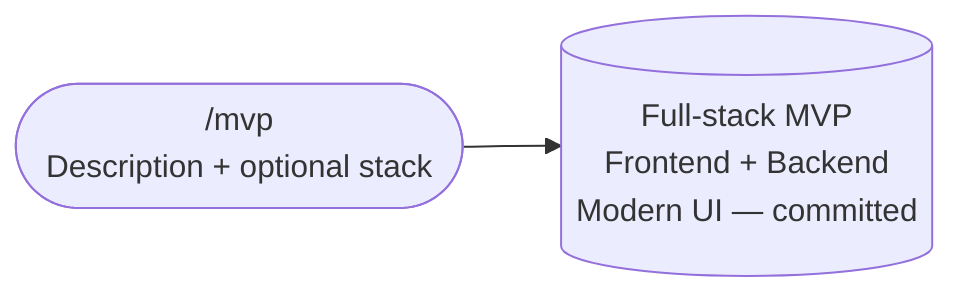
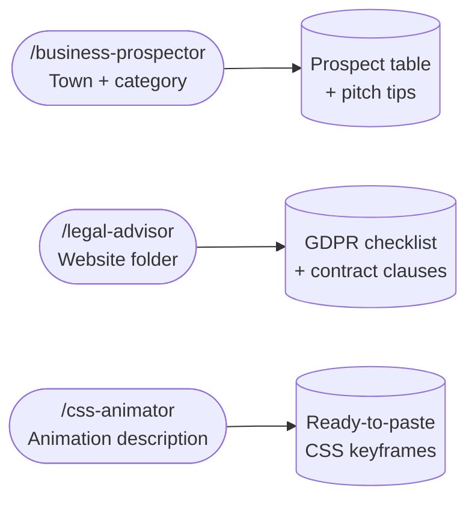
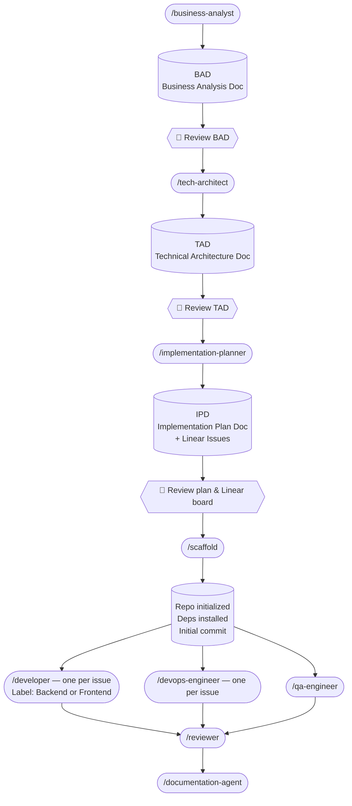

# pocket-it

An AI-powered software development pipeline built on [Claude Code](https://claude.ai/code) agents. Choose the path that fits your project: a single-command MVP builder for prototypes, or a full structured pipeline for production products.

---

## How it works

### ⚡ Lite path



### 🛠️ Standalone tools



### 🏗️ Full pipeline



---

## Pipeline steps

### Phase 1 — Planning

| Skill | What it produces | Model |
|---|---|---|
| `/business-analyst` | Business Analysis Document (BAD) — user stories, acceptance criteria, scope | Sonnet |
| `/tech-architect` | Technical Architecture Document (TAD) — stack, structure, API contracts, infra, testing strategy | Sonnet |
| `/implementation-planner` | Implementation Plan Document (IPD) — epics, stories, tasks with estimates + Linear issues with labels | Sonnet |

**Output:** three Markdown documents in `./business-analysis/`, `./tech-analysis/`, `./implementation-plans/` and a fully populated Linear project.

---

### Phase 2 — Bootstrap

| Skill | What it does | Model |
|---|---|---|
| `/scaffold [git-url]` | Reads the TAD, runs the stack init command, installs deps, creates folder structure, `.gitignore`, `.env.example`, README, then commits. Pushes to `git-url` if provided. | Sonnet |

Run `/developer` and `/devops-engineer` before `/qa-engineer` — QA needs the backend to be implemented first.

---

### Phase 3 — Build

Run one skill per Linear issue. Each agent reads the TAD and IPD, marks the issue **In Progress**, implements, and marks it **Done**.

| Skill | What it does | Model |
|---|---|---|
| `/developer Issue: LIN-42 — Title Label: Backend` | Implements one Backend issue — APIs, services, DB migrations | Sonnet |
| `/developer Issue: LIN-43 — Title Label: Frontend` | Implements one Frontend issue — UI components, pages, state | Sonnet |
| `/devops-engineer Issue: LIN-44 — Title` | Implements one DevOps issue — Dockerfiles, CI/CD, infra config | Sonnet |
| `/qa-engineer` | Implements the full test suite from all QA issues in Linear | Sonnet |
| `/reviewer` | Checks open PRs against TAD constraints and acceptance criteria | Sonnet |
| `/documentation-agent` | Writes README, API reference, and architecture overview | Sonnet |

Run `/developer` and `/devops-engineer` in parallel where Linear issues are unblocked. Run `/qa-engineer` after backend issues are merged.

---

## Setup

### Prerequisites

- [Claude Code](https://claude.ai/code) installed
- A [Linear](https://linear.app) account with the Claude AI Linear MCP connected

### Install

Clone the repo, then copy the `.claude/` folder into your target project:

```bash
git clone https://github.com/FCabiddu/pocket-it
cp -r pocket-it/.claude /your/project/root/
```

Copy the pipeline config to your global Claude Code settings so the agents have context in every project:

```bash
cp pocket-it/CLAUDE.template.md ~/.claude/CLAUDE.md
```

> If you already have a `~/.claude/CLAUDE.md`, append the contents of `CLAUDE.template.md` to it rather than overwriting.

Then install the security hook (blocks pushes containing secrets or API keys):

```bash
bash .claude/hooks/install.sh
```

Restart Claude Code. The skills will appear in your `/` menu.

---

## Usage

### Quick start

```bash
# MVP in one shot
/mvp a job board with company profiles and applicant tracking

# Find prospects in a town
/business-prospector Milano ristoranti

# Legal checklist for a client site
/legal-advisor /path/to/client-website
```

### Full pipeline

```bash
# 1. Describe your feature — agent produces the BAD
/business-analyst Build a recipe sharing app with social features

# 2. Review the BAD, then generate the architecture
/tech-architect

# 3. Review the TAD, then generate the implementation plan + Linear issues
/implementation-planner

# Review the Linear board. Edit or remove issues if needed.

# 4. Scaffold the project (optionally push to a remote)
/scaffold
# or
/scaffold https://github.com/you/your-project

# 5. Run one agent per Linear issue (parallel where unblocked)
/developer Issue: LIN-42 — User auth API Label: Backend
/developer Issue: LIN-43 — Login page Label: Frontend
/devops-engineer Issue: LIN-44 — Docker setup

# 6. Run QA after backend issues are merged, then review and document
/qa-engineer
/reviewer
/documentation-agent
```

---

## Standalone tools

These skills are independent utilities — they don't require a TAD or Linear project.

| Skill | What it does | Model |
|---|---|---|
| `/mvp [description]` | Full-stack MVP in one shot — no pipeline ceremony | Sonnet |
| `/business-prospector [town] [category?]` | Finds small businesses in a town with no or weak website — outputs a prospect table and pitch tips | Sonnet |
| `/legal-advisor [folder-path]` | Scans a client website folder and outputs an EU/Italy GDPR compliance checklist — cookie banner, privacy policy, contract clauses | Sonnet |
| `/css-animator [description]` | Returns ready-to-paste CSS animation code — matches Animate.css or writes custom keyframes | Sonnet |

---

## Model choices

| Agent | Model | Why |
|---|---|---|
| mvp-builder | Sonnet | Full-stack from plain English; Sonnet handles open-ended stack decisions well |
| business-analyst | Sonnet | Template-driven structured output |
| ux-designer | Sonnet | Design spec from BAD — structured creative output |
| tech-architect | Sonnet | TAD from BAD — research-heavy but well-structured |
| implementation-planner | Sonnet | Structured breakdown from a defined TAD |
| developer | Sonnet | Implements one issue from TAD + IPD |
| qa-engineer | Sonnet | Test suite from TAD testing pyramid |
| devops-engineer | Sonnet | Structured config files, well-defined patterns |
| reviewer | Sonnet | Diff-based checklist against TAD constraints |
| scaffold | Sonnet | Structured execution from TAD, no open-ended reasoning |
| documentation-agent | Sonnet | Writes docs from finished codebase |
| business-prospector | Sonnet | Web search + table output |
| legal-advisor | Sonnet | Checklist output from code scan |

---

## Repository structure

```
.claude/
  agents/     # Agent definitions
  skills/     # Skill launchers
README.md
```

Drop the `.claude/` folder into any project root and the skills appear automatically in Claude Code.
