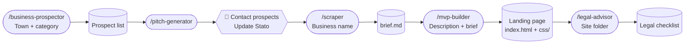
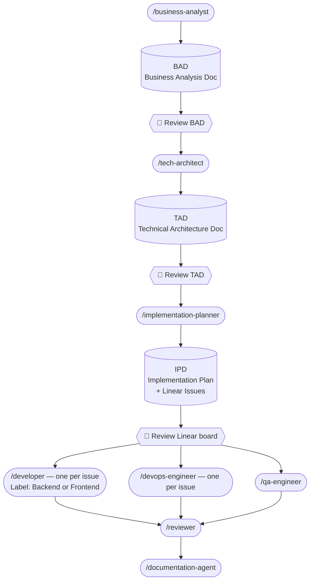
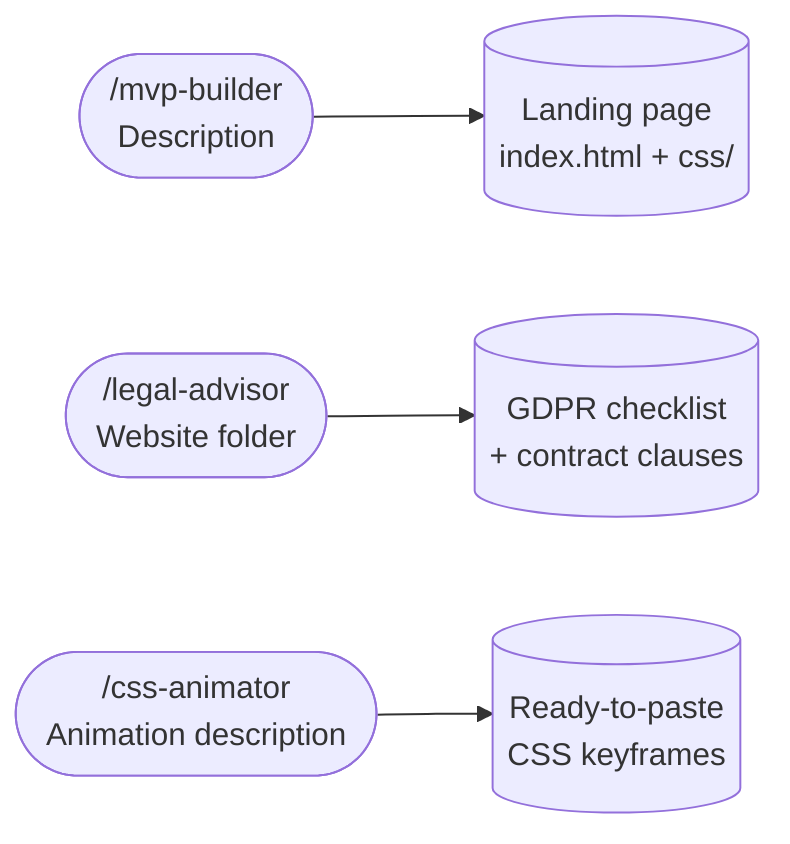

# pocket-it

An AI-powered agent toolkit built on [Claude Code](https://claude.ai/code). Two independent pipelines: a client landing-page workflow for freelance work, and a full structured pipeline for production software products.

---

## How it works

### Flow A — Client landing page



### Flow B — Full engineering pipeline



### Standalone tools



---

## Flow A — Client pipeline

| Skill | What it does | Model |
|---|---|---|
| `/business-prospector [town] [category?]` | Finds small businesses in a town with no or weak website — outputs a prospect table + interactive HTML CRM | Sonnet |
| `/pitch-generator [prospects-file?]` | Reads the prospect list and drafts personalised cold email, WhatsApp follow-up, and phone script for each unchecked prospect | Sonnet |
| `/scraper [business name]` | Searches online for all public info (address, phone, services, colours, social) and saves `brief.md` to `~/Desktop/clients/{slug}/` | Sonnet |
| `/mvp-builder [description]` | Builds an award-quality landing page from a plain-English description and optional brief — outputs `index.html` + split CSS files | Sonnet |
| `/legal-advisor [folder-path]` | Scans a client site folder and outputs an EU/Italy GDPR compliance checklist — cookie banner, privacy policy, contract clauses | Sonnet |

---

## Flow B — Full pipeline

### Phase 1 — Planning

| Skill | What it produces | Model |
|---|---|---|
| `/business-analyst` | Business Analysis Document (BAD) — user stories, acceptance criteria, scope | Sonnet |
| `/tech-architect` | Technical Architecture Document (TAD) — stack, structure, API contracts, infra, testing strategy | Opus |
| `/implementation-planner` | Implementation Plan Document (IPD) — epics, stories, tasks with estimates + Linear issues | Sonnet |

**Output:** three Markdown documents in `./business-analysis/`, `./tech-analysis/`, `./implementation-plans/` and a fully populated Linear project.

### Phase 2 — Build

Run one skill per Linear issue. Each agent reads the TAD and IPD, marks the issue **In Progress**, implements, and marks it **Done**.

| Skill | What it does | Model |
|---|---|---|
| `/developer Issue: LIN-42 — Title Label: Backend` | Implements one Backend issue — APIs, services, DB migrations | Sonnet |
| `/developer Issue: LIN-43 — Title Label: Frontend` | Implements one Frontend issue — UI components, pages, state | Sonnet |
| `/devops-engineer Issue: LIN-44 — Title` | Implements one DevOps issue — Dockerfiles, CI/CD, infra config | Sonnet |
| `/qa-engineer` | Implements the full test suite from all QA issues in Linear | Sonnet |
| `/reviewer` | Checks open PRs against TAD constraints and acceptance criteria | Sonnet |
| `/documentation-agent` | Writes README, API reference, and architecture overview | Sonnet |

Run `/developer` and `/devops-engineer` in parallel where Linear issues are unblocked. Run `/qa-engineer` after backend issues are merged.

---

## Setup

### Prerequisites

- [Claude Code](https://claude.ai/code) installed
- A [Linear](https://linear.app) account with the Claude AI Linear MCP connected (Flow B only)

### Install

Clone the repo, then copy the `.claude/` folder into your target project:

```bash
git clone https://github.com/FCabiddu/pocket-it
cp -r pocket-it/.claude /your/project/root/
```

Then install the security hook (blocks pushes containing secrets or API keys):

```bash
bash .claude/hooks/install.sh
```

Restart Claude Code. The skills will appear in your `/` menu.

---

## Usage

### Flow A — Client landing page

```bash
# Find prospects in a town
/business-prospector Milano ristoranti

# Draft outreach for all unchecked prospects in the list
/pitch-generator

# (Contact prospects, update Stato in the file manually)

# Scrape an interested prospect to build a brief
/scraper Ristorante da Mario Milano

# Build the landing page
/mvp-builder Ristorante tradizionale siciliano nel centro di Milano

# Check legal compliance before delivery
/legal-advisor ~/Desktop/clients/ristorante-da-mario
```

### Flow B — Full pipeline

```bash
# 1. Describe your feature — agent produces the BAD
/business-analyst Build a recipe sharing app with social features

# 2. Review the BAD, then generate the architecture
/tech-architect

# 3. Review the TAD, then generate the implementation plan + Linear issues
/implementation-planner

# 4. Review the Linear board. Edit or remove issues if needed.
#    Then run one agent per issue (parallel where unblocked):
/developer Issue: LIN-42 — User auth API Label: Backend
/developer Issue: LIN-43 — Login page Label: Frontend
/devops-engineer Issue: LIN-44 — Docker setup

# 5. Run QA after backend issues are merged, then review and document
/qa-engineer
/reviewer
/documentation-agent
```

### Standalone

```bash
# CSS animation on demand
/css-animator a smooth slide-in from the left on scroll
```

---

## Repository structure

```
.claude/
  agents/     # Agent definitions (one .md per agent)
  skills/     # Skill launchers (one folder per skill)
README.md
CLAUDE.md               # Maintenance guide for working on the agents
CLAUDE.template.md      # Copy this to ~/.claude/CLAUDE.md for your projects
```

Drop the `.claude/` folder into any project root and the skills appear automatically in Claude Code.
