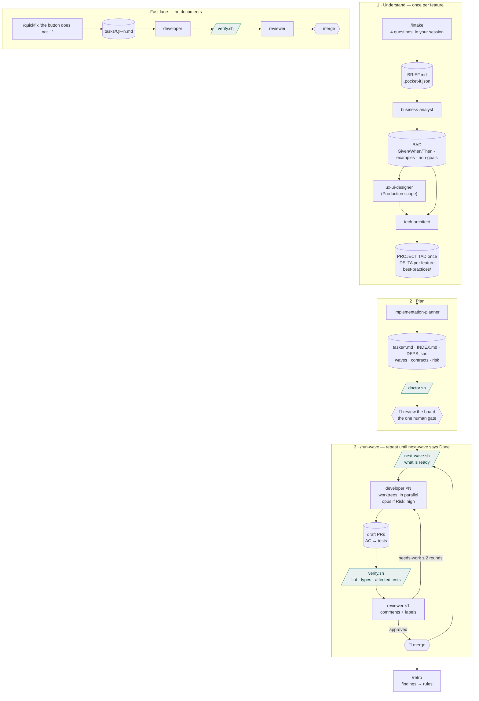

# pocket-it

An agent toolkit for [Claude Code](https://claude.ai/code) that takes a feature from one round of questions to reviewed pull requests, wave by wave and in parallel, plus a fast lane for small fixes, standalone tools that build and audit static sites, and the legal pages a client site needs.

---

## Two lanes



Rounded boxes are agents, cylinders are files on disk, parallelograms are scripts that spend no tokens, hexagons are the two moments that need you.

No agent asks questions at runtime. `/intake` asks you once; everything else reads `.pocket-it.json` and `BRIEF.md` and writes its assumptions down. Scripts, not agents, decide what is ready to launch and whether a PR is mechanically green.

## Skills

| Skill | What it does | Model |
|---|---|---|
| `/intake {one sentence}` | asks up to 4 questions, writes `business-analysis/BRIEF.md` + `.pocket-it.json`, commits, hands off | — (your session) |
| `/business-analyst` | BAD with stories as Given/When/Then criteria, examples table, non-goals | Opus |
| `/ux-ui-designer` | Design Spec (pipeline), site audit, or a design direction | Opus |
| `/tech-architect` | first feature: `PROJECT_TECH_ANALYSIS.md`; later: a short `_TECH_DELTA.md`; `best-practices/` per tech group | Opus |
| `/implementation-planner` | self-contained task files, `INDEX.md`, `DEPS.json` with waves; contract-first so backend and frontend run in the same wave; `Risk` per task | Sonnet |
| `/run-wave` | launches every ready task in parallel (worktrees; Opus for high risk), one reviewer for the wave, up to two fix rounds, report | — (your session) |
| `/developer Issue: T-1.2.3 — title Label: Backend\|Frontend\|DevOps` | one task with its unit tests, task branch, draft PR mapping criteria to tests | Sonnet / Opus |
| `/reviewer Tasks: T-1.2.3, T-1.2.4` | `verify.sh` first, then diff vs criteria, contract, TAD, best practices | Opus |
| `/qa-engineer` | integration/E2E only for QA tasks the planner justified | Sonnet |
| `/quickfix {sentence}` | fast lane: task file → developer → reviewer, no documents | — (your session) |
| `/retro EPIC-3` | turns repeated review findings into best-practices rules and template proposals | Opus |
| `/documentation-agent` | README, API reference, architecture overview, on request | Sonnet |
| `/mvp-builder {brief}` | static site in `~/Desktop/clients/{slug}/` | Sonnet |
| `/legal-advisor {client}` | privacy, cookie, terms pages + `LEGAL_CHECKLIST.md` | Opus |

## Scripts (no tokens)

```bash
bash ~/.claude/agents/pocket-it/bin/doctor.sh          # pre-flight: config, board, DEPS.json, TAD numbering, hygiene
bash ~/.claude/agents/pocket-it/bin/next-wave.sh       # what can be launched right now, as JSON lines
bash ~/.claude/agents/pocket-it/bin/verify.sh 42       # lint + type-check + affected tests on PR #42, in a throwaway worktree
bash ~/.claude/agents/pocket-it/bin/tasks-index.sh     # regenerate tasks/INDEX.md
python3 ~/.claude/agents/pocket-it/bin/usage-report.py --days 7   # where the tokens went this week
```

## Setup

1. Clone so that the repo is reachable at `~/.claude/agents/pocket-it` (e.g. a symlink from `~/Desktop/agents`).
2. In `~/.claude/settings.json`: a standard-context model for orchestration and the guard hook.

```json
{
  "model": "claude-fable-5-1",
  "hooks": { "PreToolUse": [ { "matcher": "Bash", "hooks": [ { "type": "command", "command": "bash /ABS/PATH/pocket-it/.claude/hooks/guard.sh" } ] } ] }
}
```

3. In each target project, `/intake` once (or `cp pocket-it/templates/pocket-it.json ./.pocket-it.json` and commit it).
4. Optional: `bash .claude/hooks/install.sh` in the target repo installs the pre-push secret scanner.

## A feature, end to end

```bash
/intake Gestione ordini rivenditori con email di conferma
# → BRIEF.md, .pocket-it.json, then business-analyst runs
/tech-architect business-analysis/ORDINI_RIVENDITORI_BUSINESS_ANALYSIS.md
/implementation-planner tech-analysis/ORDINI_RIVENDITORI_TECH_DELTA.md
# read tasks/INDEX.md — this is what gets built
/run-wave        # wave 1 … you merge …
/run-wave        # wave 2 … until next-wave says everything is Done
/retro EPIC-3
```

## Cost model

The 2026-09 audit found the bill dominated by an orchestration session on a 1M-context model, kept open for a day and implementing tasks itself, and by implementing agents that re-read files and ran 400+ turns. v2 counters both: the orchestrator stays thin (`/run-wave` is a recipe around two scripts), agents read the task file plus cited sections only and have `maxTurns`, unit tests ship with the code while integration/E2E are on-demand, the reviewer runs once per wave after a mechanical `verify.sh`, and hard rules live in a hook. `usage-report.py` tells you every week whether that is still true.

## Repository structure

```
.claude/
  agents/               one .md per agent · shared/ (design-compass, implementing-common)
  skills/               launchers + main-session skills (intake, quickfix, run-wave)
  hooks/                guard.sh (PreToolUse) + tests · pre-push secret scanner + install.sh
bin/                    doctor · next-wave · verify · tasks-index · usage-report
templates/pocket-it.json
docs/agent-reviews/     audits (current: AUDIT-2026-09-05.md, PIPELINE-V2-2026-09-06.md)
CLAUDE.md               maintenance guide for the agents
```
