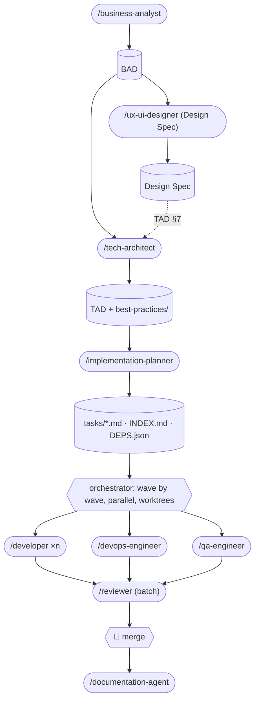

# pocket-it

An agent toolkit for [Claude Code](https://claude.ai/code) that takes a feature from business analysis to reviewed pull requests, plus standalone tools that build and audit static sites and write the legal pages a client site needs.

---

## How it works



Every stage is a subagent that reads the artefacts of the previous one from disk. No agent asks questions at runtime: a `.pocket-it.json` in the target repo answers them, and anything still unknown is written down as an assumption for you to confirm.

## Agents

| Skill | Produces | Model |
|---|---|---|
| `/business-analyst {brief}` | `business-analysis/{NAME}_BUSINESS_ANALYSIS.md` | Opus |
| `/ux-ui-designer {BAD path \| site \| brief}` | Design Spec (pipeline), audit `UX_UI_REVIEW.md`, or a design direction | Opus |
| `/tech-architect {BAD path}` | `tech-analysis/{NAME}_TECH_ANALYSIS.md` + `best-practices/` | Opus |
| `/implementation-planner {TAD path}` | `tasks/T-*.md`, `tasks/INDEX.md`, `implementation-plans/{NAME}_DEPS.json`, short IPD | Sonnet |
| `/developer Issue: T-1.2.3 — title Label: Backend` | one task with tests, task branch, draft PR | Sonnet |
| `/devops-engineer Issue: T-1.1.2 — title` | one infra task, draft PR | Sonnet |
| `/qa-engineer` | integration, E2E and a11y tests for all open QA tasks, draft PR, bug tasks | Sonnet |
| `/reviewer PRs: 12, 13` or `Tasks: T-1.2.3` | review by diff vs task criteria, TAD, best practices; conflicts; CI routing | Opus |
| `/documentation-agent` | README, `docs/API.md`, `docs/ARCHITECTURE.md`, draft PR | Sonnet |
| `/mvp-builder {brief}` | static site in `~/Desktop/clients/{slug}/` | Sonnet |
| `/legal-advisor {client}` | privacy, cookie, terms pages + `LEGAL_CHECKLIST.md` | Opus |

## Setup

1. Clone and let Claude Code see the agents (this repo is designed to live at `~/.claude/agents/pocket-it`, e.g. via a symlink from `~/Desktop/agents`).
2. Register the guard hook and drop the 1M-context model for orchestration in `~/.claude/settings.json`:

```json
{
  "model": "claude-fable-5-1",
  "hooks": { "PreToolUse": [ { "matcher": "Bash", "hooks": [ { "type": "command", "command": "bash /ABS/PATH/pocket-it/.claude/hooks/guard.sh" } ] } ] }
}
```

3. In each target project: `cp pocket-it/templates/pocket-it.json ./.pocket-it.json` and set `scope`, `automerge`, `pipeline`, `baseBranch`, `testCommand`.
4. Optional: `bash .claude/hooks/install.sh` in the target repo installs the pre-push secret scanner.

## Running a feature

```bash
/business-analyst  Gestione ordini rivenditori con email di conferma
/tech-architect    business-analysis/ORDINI_RIVENDITORI_TECH_ANALYSIS.md
/implementation-planner tech-analysis/ORDINI_RIVENDITORI_TECH_ANALYSIS.md
# then, wave by wave from DEPS.json — one message, several agents, isolation: worktree
/developer Issue: T-3.1.1 — Migrazione tabella ordini  Label: Backend
/developer Issue: T-3.2.1 — Form ordine rivenditore   Label: Frontend
/reviewer  Tasks: T-3.1.1, T-3.2.1
# you merge; next wave; at the end
/qa-engineer
/documentation-agent
```

## Cost model

The 2026-09 audit found the bill dominated by two things: an orchestration session on a 1M-context model, kept open for a day and implementing tasks itself, and implementing agents that re-read files and ran 400+ turns. The current design counters both: the orchestrator delegates and stays small (one session per epic, standard context), agents read the task file plus cited TAD sections only, have `maxTurns`, ship tests with code, and the reviewer runs per batch. Hard rules (no merge, no push to main, no `pkill`, no CI flips, no sleep-polling) are enforced by a hook, not by prompt text.

## Repository structure

```
.claude/
  agents/               one .md per agent
    shared/             design-compass.md · implementing-common.md
  skills/               /launchers (forward $ARGUMENTS to the native agent)
  hooks/                guard.sh (PreToolUse) · pre-push secret scanner + install.sh
bin/tasks-index.sh      regenerates tasks/INDEX.md
templates/pocket-it.json
docs/agent-reviews/     audits and change logs
CLAUDE.md               maintenance guide for the agents
```
