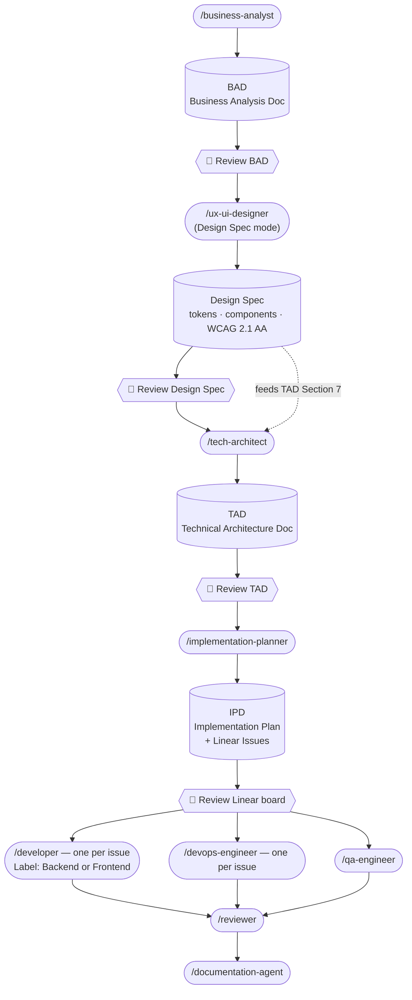
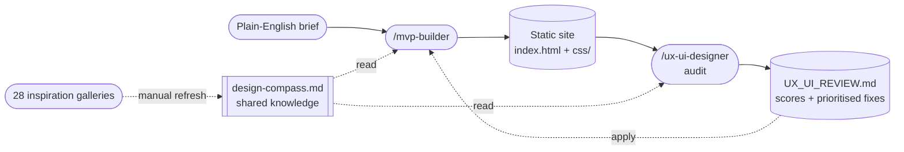

# pocket-it

An AI-powered agent toolkit built on [Claude Code](https://claude.ai/code) for end-to-end software product delivery — from business analysis to production code — plus standalone design tools that build and audit static sites.

---

## How it works



---

## Agents

### Phase 1 — Planning

| Skill | What it produces | Model |
|---|---|---|
| `/business-analyst` | Business Analysis Document (BAD) — user stories, acceptance criteria, scope | Sonnet |
| `/ux-ui-designer` | Enterprise Design Spec — design tokens, component specs with accessibility contracts, page/screen specs, information architecture, WCAG 2.1 AA. Feeds TAD Section 7. **Default step for Production/enterprise scope; optional for MVP/static** | Opus |
| `/tech-architect` | Technical Architecture Document (TAD) — stack, structure, API contracts, infra, testing strategy. Reads the Design Spec if present | Opus |
| `/implementation-planner` | Implementation Plan Document (IPD) — epics, stories, tasks with estimates + Linear issues | Sonnet |

**Output:** Markdown documents in `./business-analysis/`, `./design-specs/`, `./tech-analysis/`, `./implementation-plans/` and a fully populated Linear project.

### Phase 2 — Build

Run one skill per Linear issue. Each agent reads the TAD and IPD, marks the issue **In Progress**, implements, and marks it **Done**.

| Skill | What it does | Model |
|---|---|---|
| `/developer Issue: LIN-42 — Title Label: Backend` | Implements one Backend issue — APIs, services, DB migrations | Sonnet |
| `/developer Issue: LIN-43 — Title Label: Frontend` | Implements one Frontend issue — UI components, pages, state | Sonnet |
| `/devops-engineer Issue: LIN-44 — Title` | Implements one DevOps issue — Dockerfiles, CI/CD, infra config | Sonnet |
| `/qa-engineer` | Implements the full test suite from all QA issues in Linear | Sonnet |
| `/reviewer` | Checks open PRs against TAD constraints and acceptance criteria | Sonnet |
| `/documentation-agent` | Writes README, API reference, and architecture overview | Sonnet |

Run `/developer` and `/devops-engineer` in parallel where Linear issues are unblocked. Run `/qa-engineer` after backend issues are merged.

---

## Standalone design tools

Independent of the Flow B pipeline — no BAD/TAD/Linear required. `/mvp-builder` turns a plain-English brief into an award-quality static site; `/ux-ui-designer` (mode A) audits that site and returns prioritised, copy-pasteable fixes, or (mode B) gives a lightweight design direction from a brief. Both draw on one shared **design compass** so the builder and the reviewer judge by the same standard. (The same `/ux-ui-designer` also runs inside Flow B in its Enterprise Design Spec mode — see [How it works](#how-it-works).)



| Skill | What it does | Model |
|---|---|---|
| `/mvp-builder Build a portfolio site for a tattoo artist` | Builds a static site — `index.html` + `css/` (one file per section) + vanilla JS — in `~/Desktop/clients/{slug}/` | Sonnet |
| `/ux-ui-designer ~/Desktop/clients/my-site` | Audits a built site against the compass, scores 8 dimensions 1–5, writes `UX_UI_REVIEW.md`. Given only a static brief, returns a design direction instead | Opus |

**Shared design compass** — `.claude/agents/shared/design-compass.md` holds the distilled design knowledge (25 layout archetypes, typography, colour, Industry Design DNA, decorative elements, 15-technique animation catalogue). Both agents read it at runtime; it is never copied inline. Edit it once and both agents follow.

**Inspiration library** — `/ux-ui-designer` keeps 28 curated inspiration galleries as a **manual** refresh channel: a human browses them and distils new trends into the compass. The agent does not fetch them at runtime (they are JS-heavy SPAs that return no usable design signal to a fetch).

---

## Setup

### Prerequisites

- [Claude Code](https://claude.ai/code) installed
- A [Linear](https://linear.app) account with the Claude AI Linear MCP connected

### Install

Clone the repo, then copy the `.claude/` folder into your target project:

```bash
git clone https://github.com/FCabiddu/pocket-it
cp -r pocket-it/.claude /your/project/root/
```

Then install the security hook (blocks pushes containing secrets or API keys):

```bash
bash .claude/hooks/install.sh
```

Restart Claude Code. The skills will appear in your `/` menu.

---

## Usage

```bash
# 1. Describe your feature — agent produces the BAD
/business-analyst Build a recipe sharing app with social features

# 2. Review the BAD, then design the UX/UI foundation (tokens, components, screens, WCAG 2.1 AA)
#    Default step for Production/enterprise scope; optional for MVP/static.
/ux-ui-designer business-analysis/RECIPE_APP_BUSINESS_ANALYSIS.md

# 3. Review the Design Spec, then generate the architecture (it reads the spec into TAD §7)
/tech-architect

# 4. Review the TAD, then generate the implementation plan + Linear issues
/implementation-planner

# 5. Review the Linear board. Edit or remove issues if needed.
#    Then run one agent per issue (parallel where unblocked):
/developer Issue: LIN-42 — User auth API Label: Backend
/developer Issue: LIN-43 — Login page Label: Frontend
/devops-engineer Issue: LIN-44 — Docker setup

# 6. Run QA after backend issues are merged, then review and document
/qa-engineer
/reviewer
/documentation-agent
```

---

## Repository structure

```
.claude/
  agents/           # Agent definitions (one .md per agent)
    shared/         # Cross-agent references — design-compass.md (mvp-builder + ux-ui-designer)
  skills/           # Skill launchers (one folder per skill)
README.md
CLAUDE.md           # Maintenance guide for working on the agents
```
