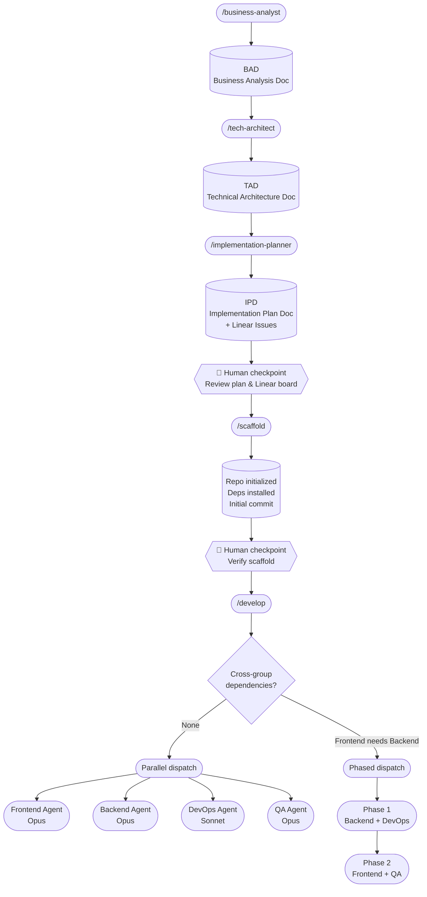

# pocket-it

An AI-powered software development pipeline built on [Claude Code](https://claude.ai/code) agents. Describe a feature and let a chain of specialized agents plan, scaffold, and implement it — from business requirements all the way to working code.

---

## How it works

The pipeline runs in three phases. Each phase is a manual step — you review the output before moving to the next.



---

## Pipeline steps

### Phase 1 — Planning

| Command | What it produces | Model |
|---|---|---|
| `/business-analyst` | Business Analysis Document (BAD) — user stories, acceptance criteria, scope | Sonnet |
| `/tech-architect` | Technical Architecture Document (TAD) — stack, structure, API contracts, infra, testing strategy | Opus |
| `/implementation-planner` | Implementation Plan Document (IPD) — epics, stories, tasks with estimates + Linear issues with labels | Sonnet |

**Output:** three Markdown documents in `./business-analysis/`, `./tech-analysis/`, `./implementation-plans/` and a fully populated Linear project.

---

### Phase 2 — Bootstrap

| Command | What it does | Model |
|---|---|---|
| `/scaffold [git-url]` | Reads the TAD, runs the stack init command, installs deps, creates folder structure, `.gitignore`, `.env.example`, README, then commits. Pushes to `git-url` if provided. | Sonnet |

**`/develop` hard-blocks if scaffold has not been run.**

---

### Phase 3 — Build

| Command | What it does | Model |
|---|---|---|
| `/develop` | Surveys the Linear board, groups tasks by label, checks cross-group dependencies, presents a dispatch plan, then spawns developer agents in parallel or in phases. | Sonnet |

Developer agents spawned by `/develop`:

| Agent | Responsibility | Model |
|---|---|---|
| `frontend-developer` | UI components, pages, state management, routing — reads TAD for exact stack | Opus |
| `backend-developer` | APIs, services, database migrations, background jobs — reads TAD for exact stack | Opus |
| `devops-engineer` | Dockerfiles, CI/CD pipelines, infrastructure config — reads TAD for exact infra | Sonnet |
| `qa-engineer` | Full testing pyramid — unit, component, integration, E2E — reads TAD for exact test stack | Opus |

Each agent: marks Linear issues **In Progress** when starting, **Done** when complete.

---

## Setup

### Prerequisites

- [Claude Code](https://claude.ai/code) installed
- A [Linear](https://linear.app) account with the Claude AI Linear MCP connected

### Install

Clone the repo, then copy the `.claude/` folder into your target project:

```bash
git clone https://github.com/FCabiddu/pocket-it
cp -r pocket-it/.claude /your/project/root/
```

Copy the pipeline config to your global Claude Code settings so the agents have context in every project:

```bash
cp pocket-it/CLAUDE.template.md ~/.claude/CLAUDE.md
```

> If you already have a `~/.claude/CLAUDE.md`, append the contents of `CLAUDE.template.md` to it rather than overwriting.

Then install the security hook (blocks pushes containing secrets or API keys):

```bash
bash .claude/hooks/install.sh
```

Restart Claude Code. The commands will appear in your `/` command list.

---

## Usage

```bash
# 1. Describe your feature — agent produces the BAD
/business-analyst Build a recipe sharing app with social features

# 2. Review the BAD, then generate the architecture
/tech-architect

# 3. Review the TAD, then generate the implementation plan + Linear issues
/implementation-planner

# Review the Linear board. Edit or remove issues if needed.

# 4. Scaffold the project (optionally push to a remote)
/scaffold
# or
/scaffold https://github.com/you/your-project

# 5. Dispatch developer agents
/develop
```

---

## Model choices

| Agent | Model | Why |
|---|---|---|
| business-analyst | Sonnet | Template-driven structured output |
| tech-architect | **Opus** | Open-ended research, high-stakes irreversible architectural decisions |
| implementation-planner | Sonnet | Structured breakdown from a defined TAD |
| frontend-developer | **Opus** | Adapts to unknown stack, produces core codebase |
| backend-developer | **Opus** | Same — APIs, migrations, business logic |
| qa-engineer | **Opus** | Test design requires reasoning across the whole codebase |
| devops-engineer | Sonnet | Structured config files, well-defined patterns |
| develop (orchestrator) | Sonnet | Reads Linear + dispatches agents, no deep reasoning needed |
| scaffold | Sonnet | Structured execution from TAD, no open-ended reasoning |

---

## Repository structure

```
.claude/
  agents/     # Agent definitions
  commands/   # Command launchers
README.md
```

Drop the `.claude/` folder into any project root and the commands appear automatically in Claude Code.
