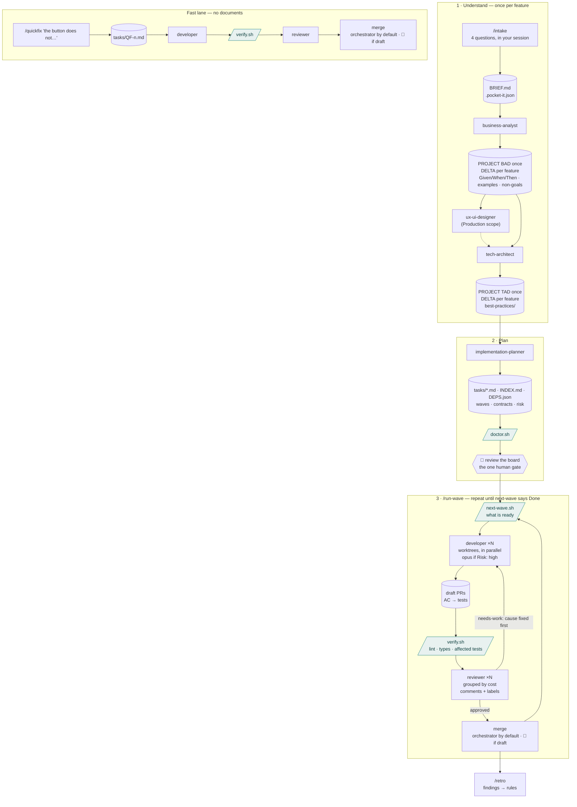

# pocket-it

An agent toolkit for [Claude Code](https://claude.ai/code) that takes a feature from one round of questions to reviewed pull requests, wave by wave and in parallel, plus a fast lane for small fixes, standalone tools that build and audit static sites, and the legal pages a client site needs.

---

## Two lanes



Rounded boxes are agents, cylinders are files on disk, parallelograms are scripts that spend no tokens, the hexagon is the one moment that needs you.

Every entry point is a plain command, so pocket-it works on its own or under any orchestrator you put in front of it: `status.sh` tells an orchestrator where the project is, `next-wave.sh` what can be launched, and the three main-session skills (`/intake`, `/quickfix`, `/run-wave`) are the only places that talk to the user. One thing always stays with the human: reviewing the board before wave 1. Approved PRs are merged by the orchestrator by default (`automerge: true`); say `draft` in the request, or set `automerge: false`, and it reviews but leaves the merge to you. The epic→main PR of a deployed project is a deploy: opened and merged only when you ask.

No agent asks questions at runtime. `/intake` asks you once; everything else reads `.pocket-it.json` and `BRIEF.md` and writes its assumptions down. Scripts, not agents, decide what is ready to launch and whether a PR is mechanically green. Memory across sessions lives on disk: the board and git for state, `docs/SESSION_HANDOFF.md` (written by agents through `handoff.sh`) for facts and events — never `--resume`.

## Skills

| Skill | What it does | Model |
|---|---|---|
| `/intake {one sentence}` | asks up to 4 questions, writes `business-analysis/BRIEF.md` + `.pocket-it.json`, commits, hands off | — (your session) |
| `/business-analyst` | first feature: `PROJECT_BUSINESS_ANALYSIS.md`; later: a short `_BUSINESS_DELTA.md` (new/changed stories as Given/When/Then, numbering continued, impact on the project BAD) | Opus |
| `/ux-ui-designer` | Design Spec (pipeline), site audit, or a design direction | Opus |
| `/tech-architect` | first feature: `PROJECT_TECH_ANALYSIS.md`; later: a short `_TECH_DELTA.md`; `best-practices/` per tech group | Opus |
| `/implementation-planner` | self-contained task files, `INDEX.md`, `DEPS.json` with waves; contract-first so backend and frontend run in the same wave; `Risk` per task | Sonnet |
| `/run-wave` | launches every ready task in parallel (worktrees; Opus for high risk), reviewers grouped by measured cost, a red PR gets its cause fixed at the source before another round, merges the approved PRs (unless `draft`), report | — (your session) |
| `/developer Issue: T-1.2.3 — title Label: Backend\|Frontend\|DevOps` | one task with its unit tests, task branch, draft PR mapping criteria to tests | Sonnet / Opus |
| `/reviewer Tasks: T-1.2.3, T-1.2.4` | `verify.sh` first, then diff vs criteria, contract, TAD, best practices | Opus |
| `/qa-engineer` | integration/E2E only for QA tasks the planner justified | Sonnet |
| `/quickfix {sentence}` | fast lane: task file → developer → reviewer → merge (unless `draft`), no documents | — (your session) |
| `/retro EPIC-3` | turns repeated review findings into best-practices rules and template proposals | Opus |
| `/documentation-agent` | README, API reference, architecture overview, on request | Sonnet |

`/ux-ui-designer` also works standalone on a static site (audit with scores and copy-pasteable fixes, or a design direction from a brief), reading the shared `design-compass.md`.

## Scripts (no tokens)

```bash
bash ~/.claude/agents/pocket-it/bin/doctor.sh          # pre-flight: config, board, DEPS.json, BAD project/delta, TAD numbering, hygiene
bash ~/.claude/agents/pocket-it/bin/next-wave.sh       # what can be launched right now, as JSON lines
bash ~/.claude/agents/pocket-it/bin/verify.sh 42       # lint + type-check + affected tests on PR #42, in a throwaway worktree
bash ~/.claude/agents/pocket-it/bin/status.sh          # project state from disk, ~25 lines (what an orchestrator reads first)
bash ~/.claude/agents/pocket-it/bin/handoff.sh log "…"   # append to docs/SESSION_HANDOFF.md (agents do this; `fact "…"` for gotchas)
bash ~/.claude/agents/pocket-it/bin/tasks-index.sh     # regenerate tasks/INDEX.md
bash ~/.claude/agents/pocket-it/bin/cleanup-merged.sh [--dry-run] [--all]   # remove worktrees + local branches of merged PRs (run-wave/quickfix do it after each merge)
python3 ~/.claude/agents/pocket-it/bin/usage-report.py --days 7   # where the tokens went this week
bash ~/.claude/pocket-it-live/bin/install-live.sh      # after every merge into main of pocket-it: fast-forward the installed copy (see Setup)
```

## Setup

pocket-it lives in **two folders** that must never be the same:

| | Installed copy | Development checkout |
|---|---|---|
| Path | `~/.claude/pocket-it-live`, reached as `~/.claude/agents/pocket-it` | anywhere else — never inside `~/.claude/agents` or `~/.claude/skills` |
| Written by | `bin/install-live.sh` only, from the published `main` | agents and humans, through branches and PRs |
| Read by | the guard hook, `~/.claude/skills`, agent discovery, every `~/.claude/agents/pocket-it/bin/…` command | nobody at runtime |

If the two are one folder, any write that lands in the checkout by mistake (an agent whose worktree disappeared and whose shell fell back to the main checkout, say) is live in every session before anyone reviews it — including a half-edited guard hook. Only needed if you develop pocket-it itself: a user who never edits it can skip the development checkout.

1. Install the copy and make it reachable: `git clone --branch main <pocket-it repository URL> ~/.claude/pocket-it-live`, then `mkdir -p ~/.claude/agents && ln -s ~/.claude/pocket-it-live ~/.claude/agents/pocket-it`, then make the skills global with one symlink per skill: `mkdir -p ~/.claude/skills && for s in ~/.claude/pocket-it-live/.claude/skills/*/; do ln -sfn "${s%/}" ~/.claude/skills/"$(basename "$s")"; done`.
2. In `~/.claude/settings.json`: a standard-context model for orchestration and the guard hook, **from the installed copy** (replace `/ABS/HOME` with your home folder).

```json
{
  "model": "claude-fable-5-1",
  "hooks": { "PreToolUse": [ { "matcher": "Bash", "hooks": [ { "type": "command", "command": "bash /ABS/HOME/.claude/pocket-it-live/.claude/hooks/guard.sh" } ] } ] }
}
```

3. In each target project, `/intake` once (or `cp ~/.claude/agents/pocket-it/templates/pocket-it.json ./.pocket-it.json` and commit it).
4. Optional: `bash .claude/hooks/install.sh` in the target repo installs the pre-push secret scanner.

### Keeping the installed copy current

**After every merge into `main` of pocket-it**, bring the reviewed change into use:

```bash
bash ~/.claude/pocket-it-live/bin/install-live.sh
```

It fetches the published `main` and fast-forwards the copy; nothing else ever writes there. Before a file moves it checks that the new commit has the guard hook, agents, skills and itself, and that every `*.sh` in `.claude/hooks` and `bin` parses. It refuses — exit 1, copy left exactly as it was, reason on stderr — if the copy has local modifications (tracked or untracked), has commits of its own, is not on `main`, if the published `main` was rewritten, or if the new commit fails the checks. A refusal is fixed at its cause, never by editing the installed copy: a copy that has drifted is rebuilt with `mv ~/.claude/pocket-it-live ~/.claude/pocket-it-live.old && bash ~/.claude/pocket-it-live.old/bin/install-live.sh --dest ~/.claude/pocket-it-live` (hooks fail open for the seconds between the two commands). Sessions already open keep the hooks they started with; open a new one to use the update.

### Switching an existing setup to the installed copy

For a machine where the hook, the skills or `~/.claude/agents/pocket-it` still read the development checkout. Every step is a block to run as it is, in order, in any shell; each one stops by itself on the first error. Only step 0 has a value to replace. Close the other Claude Code sessions first. Nothing inside the development checkout is changed, and every step is undone by **Rollback** below.

**Step 0 — record the two folders.** Replace the one marked value with the absolute path of the development checkout.

```bash
bash -eu <<'STEP'
DEV="/ABS/PATH/OF/THE/DEVELOPMENT/CHECKOUT"          # <- the only value to replace
LIVE="$HOME/.claude/pocket-it-live"
BK="$HOME/.claude/pocket-it-switch-backup"
[ -d "$DEV/.git" ] || { echo "STOP: $DEV is not a git checkout"; exit 1; }
[ ! -e "$LIVE" ]   || { echo "STOP: $LIVE already exists — nothing to switch, or a previous attempt: see Rollback"; exit 1; }
[ ! -e "$BK" ]     || { echo "STOP: $BK exists — a switch was already started: see Rollback"; exit 1; }
DEV=$(cd "$DEV" && pwd -P)
mkdir -p "$BK"
printf 'DEV=%q\nLIVE=%q\nBK=%q\n' "$DEV" "$LIVE" "$BK" > "$BK/env"
echo "OK step 0: DEV=$DEV LIVE=$LIVE"
STEP
```

**Step 1 — back up and classify.** Saves `settings.json`, the skill links and how `~/.claude/agents/pocket-it` is reached, and writes the helper that rewrites hook paths.

```bash
bash -eu <<'STEP'
. "$HOME/.claude/pocket-it-switch-backup/env"
A="$HOME/.claude/agents"; SK="$HOME/.claude/skills"
cp -p "$HOME/.claude/settings.json" "$BK/settings.json"
if [ -L "$SK" ]; then
  readlink "$SK" > "$BK/skills.link"
else
  : > "$BK/skills.tsv"
  for l in "$SK"/*; do if [ -L "$l" ]; then printf '%s\t%s\n' "$(basename "$l")" "$(readlink "$l")" >> "$BK/skills.tsv"; fi; done
fi
if [ -L "$A/pocket-it" ]; then
  CASE=link; readlink "$A/pocket-it" > "$BK/agents-pocket-it.link"
elif [ -L "$A" ] && [ "$(cd "$A/pocket-it" 2>/dev/null && pwd -P)" = "$DEV" ]; then
  CASE=parent-link; readlink "$A" > "$BK/agents.link"
elif [ -d "$A/pocket-it" ] && [ "$(cd "$A/pocket-it" && pwd -P)" = "$DEV" ]; then
  CASE=inside
elif [ ! -e "$A/pocket-it" ]; then
  CASE=absent
else
  echo "STOP: $A/pocket-it is neither the development checkout nor a link — not covered here"; exit 1
fi
echo "$CASE" > "$BK/agents.case"
cat > "$BK/rewrite-hooks.py" <<'PY'
import json, os, shlex, sys
src, dst = os.path.realpath(sys.argv[1]), sys.argv[2]
p = os.path.expanduser("~/.claude/settings.json")
with open(p) as f:
    s = json.load(f)
n = 0
for groups in (s.get("hooks") or {}).values():
    for g in groups:
        for h in g.get("hooks", []):
            c = h.get("command", "")
            try:
                toks = shlex.split(c)
            except ValueError:
                continue
            for t in toks:
                if "/" not in t:
                    continue
                r = os.path.realpath(os.path.expanduser(t))
                if r == src or r.startswith(src + os.sep):
                    new = os.path.join(dst, os.path.relpath(r, src))
                    print("hook: " + t + " -> " + new)
                    c = c.replace(t, new); n += 1
            h["command"] = c
tmp = p + ".pocket-it-tmp"
with open(tmp, "w") as f:
    json.dump(s, f, indent=2, ensure_ascii=False); f.write("\n")
os.replace(tmp, p)
print(str(n) + " hook path(s) rewritten")
PY
echo "OK step 1: backup in $BK, agents case: $CASE"
[ "$CASE" != inside ] || echo "STOP: the development checkout IS ~/.claude/agents/pocket-it — run 'Step 1b' before step 2"
STEP
```

**Step 1b — only if step 1 printed `agents case: inside`.** The checkout has to move out of `~/.claude/agents`; replace the one marked value, run the block, then start again from step 0 with the new path.

```bash
bash -eu <<'STEP'
. "$HOME/.claude/pocket-it-switch-backup/env"
NEWDEV="/ABS/PATH/OUTSIDE/DOT-CLAUDE/FOR/THE/DEVELOPMENT/CHECKOUT"   # <- replace
[ ! -e "$NEWDEV" ] || { echo "STOP: $NEWDEV exists"; exit 1; }
WTS=$(git -C "$DEV" worktree list --porcelain | sed -n 's/^worktree //p' | tail -n +2)
mv "$DEV" "$NEWDEV"
for w in $WTS; do case "$w" in "$DEV"/*) w="$NEWDEV/${w#"$DEV"/}";; esac; git -C "$NEWDEV" worktree repair "$w"; done
rm -rf "$BK"
echo "OK step 1b: moved to $NEWDEV — start again from step 0 with DEV=$NEWDEV"
STEP
```

**Step 2 — install the copy** with the published version of the installer, never the checkout's working file.

```bash
bash -eu <<'STEP'
. "$HOME/.claude/pocket-it-switch-backup/env"
git -C "$DEV" fetch -q origin main
git -C "$DEV" show origin/main:bin/install-live.sh > "$BK/install-live.sh"
bash "$BK/install-live.sh" --dest "$LIVE" --remote "$(git -C "$DEV" remote get-url origin)"
echo "OK step 2"
STEP
```

**Step 3 — hooks.** Every hook command path that resolves into the development checkout is rewritten to the same file in the installed copy; the rest of `settings.json` is left as it is.

```bash
bash -eu <<'STEP'
. "$HOME/.claude/pocket-it-switch-backup/env"
python3 "$BK/rewrite-hooks.py" "$DEV" "$LIVE"
echo "OK step 3"
STEP
```

**Step 4 — skills.** Every skill link that resolves into the development checkout is pointed at the same folder in the installed copy.

```bash
bash -eu <<'STEP'
. "$HOME/.claude/pocket-it-switch-backup/env"
SK="$HOME/.claude/skills"
if [ -L "$SK" ]; then
  r=$(cd "$SK" && pwd -P)
  case "$r" in "$DEV"/*) ln -sfn "$LIVE/${r#"$DEV"/}" "$SK"; echo "skills -> $LIVE/${r#"$DEV"/}";; esac
else
  for l in "$SK"/*; do
    if [ -L "$l" ]; then
      r=$(cd "$l" 2>/dev/null && pwd -P || true)
      case "$r" in "$DEV"/*) ln -sfn "$LIVE/${r#"$DEV"/}" "$l"; echo "$(basename "$l") -> $LIVE/${r#"$DEV"/}";; esac
    fi
  done
fi
echo "OK step 4"
STEP
```

**Step 5 — agents.** Makes `~/.claude/agents/pocket-it` the installed copy. When `~/.claude/agents` was a link to a folder holding the checkout (`parent-link`), it becomes a real folder of links to every entry of that folder except `pocket-it`; the folder itself is not touched.

```bash
bash -eu <<'STEP'
. "$HOME/.claude/pocket-it-switch-backup/env"
A="$HOME/.claude/agents"
case "$(cat "$BK/agents.case")" in
  link)   ln -sfn "$LIVE" "$A/pocket-it" ;;
  absent) mkdir -p "$A"; ln -s "$LIVE" "$A/pocket-it" ;;
  parent-link)
    HUB=$(cd "$A" && pwd -P)
    rm "$A"
    mkdir "$A"
    for e in "$HUB"/* "$HUB"/.[!.]*; do
      if [ -e "$e" ] && [ "$(basename "$e")" != pocket-it ]; then ln -s "$e" "$A/$(basename "$e")"; fi
    done
    ln -s "$LIVE" "$A/pocket-it" ;;
  *) echo "STOP: agents case $(cat "$BK/agents.case") — see step 1"; exit 1 ;;
esac
echo "OK step 5"
STEP
```

**Step 6 — verify.** Every line must read `OK`. Then open a new Claude Code session: `/hooks` shows `guard.sh` under `~/.claude/pocket-it-live`, `/agents` lists `developer`, `reviewer` and the others. Any `FAIL`, or a missing agent: **Rollback**.

```bash
bash <<'STEP'
. "$HOME/.claude/pocket-it-switch-backup/env"
fail=0
chk() { if eval "$2"; then echo "OK    $1"; else echo "FAIL  $1"; fail=1; fi; }
LIVE_P=$(cd "$LIVE" 2>/dev/null && pwd -P) && [ -d "$LIVE/.git" ] || { echo "FAIL  the installed copy $LIVE does not exist — SOMETHING FAILED — run Rollback"; exit 1; }
chk "installed copy is a separate folder" '[ "$LIVE_P" != "$DEV" ]'
chk "installed copy is clean and at the published main" 'h=$(git -C "$LIVE" rev-parse HEAD) && [ "$h" = "$(git -C "$LIVE" rev-parse origin/main)" ] && [ -z "$(git -C "$LIVE" status --porcelain)" ]'
chk "~/.claude/agents/pocket-it is the installed copy" '[ "$(cd "$HOME/.claude/agents/pocket-it" && pwd -P)" = "$LIVE_P" ]'
chk "agent files readable through it" '[ -f "$HOME/.claude/agents/pocket-it/.claude/agents/developer.md" ]'
chk "no skill resolves into the development checkout" '! for l in "$HOME/.claude/skills"/*; do (cd "$l" 2>/dev/null && pwd -P); done | grep -q "^$DEV/"'
GUARDS=$(python3 -c 'import json,os
s=json.load(open(os.path.expanduser("~/.claude/settings.json")))
for gs in (s.get("hooks") or {}).values():
    for g in gs:
        for h in g.get("hooks",[]):
            if "guard.sh" in h.get("command",""): print(h["command"])')
chk "settings.json has a guard.sh hook" '[ -n "$GUARDS" ]'
chk "no hook command names the development checkout" '! python3 -c "import json,os;print(json.dumps(json.load(open(os.path.expanduser(\"~/.claude/settings.json\"))).get(\"hooks\",{})))" | grep -qF "$DEV/"'
while IFS= read -r c; do
  [ -n "$c" ] || continue
  chk "guard hook runs from the installed copy: $c" 'case "$c" in *"$LIVE/.claude/hooks/guard.sh"*|*"$LIVE_P/.claude/hooks/guard.sh"*) true;; *) false;; esac'
  printf '%s' '{"tool_name":"Bash","tool_input":{"command":"killall node"}}' | bash -c "$c" >/dev/null 2>&1; rc=$?
  chk "guard hook blocks a forbidden command (exit 2, got $rc)" '[ "$rc" -eq 2 ]'
  printf '%s' '{"tool_name":"Bash","tool_input":{"command":"ls"}}' | bash -c "$c" >/dev/null 2>&1; rc=$?
  chk "guard hook allows a harmless command (exit 0, got $rc)" '[ "$rc" -eq 0 ]'
done <<< "$GUARDS"
[ "$fail" -eq 0 ] && echo "ALL OK — keep $BK until a new session confirms, then delete it" || echo "SOMETHING FAILED — run Rollback"
STEP
```

If you rebuild `~/.claude/skills` with a script of your own, point it at `~/.claude/agents/pocket-it`, or its next run undoes step 4. After a `parent-link` switch, an entry added later to the folder `~/.claude/agents` used to point to is not visible until linked: `ln -s <that folder>/<entry> ~/.claude/agents/<entry>`.

**Rollback** — undoes steps 3, 4 and 5 from the backup, in any state the switch stopped in. The installed copy stays on disk, unused; delete it with `rm -rf ~/.claude/pocket-it-live` if you want.

```bash
bash -eu <<'STEP'
[ -f "$HOME/.claude/pocket-it-switch-backup/env" ] || { echo "OK rollback: no backup at ~/.claude/pocket-it-switch-backup, nothing was switched"; exit 0; }
. "$HOME/.claude/pocket-it-switch-backup/env"
A="$HOME/.claude/agents"; SK="$HOME/.claude/skills"
if [ -f "$BK/rewrite-hooks.py" ] && [ -e "$LIVE" ]; then python3 "$BK/rewrite-hooks.py" "$LIVE" "$DEV"; fi
if [ -f "$BK/skills.link" ]; then
  ln -sfn "$(cat "$BK/skills.link")" "$SK"
elif [ -f "$BK/skills.tsv" ]; then
  while IFS=$'\t' read -r n t; do ln -sfn "$t" "$SK/$n"; done < "$BK/skills.tsv"
fi
case "$(cat "$BK/agents.case" 2>/dev/null)" in
  link)   ln -sfn "$(cat "$BK/agents-pocket-it.link")" "$A/pocket-it" ;;
  absent) rm -f "$A/pocket-it" ;;
  parent-link)
    if [ ! -L "$A" ]; then
      find "$A" -mindepth 1 -maxdepth 1 -type l -exec rm {} +
      rmdir "$A"
      ln -s "$(cat "$BK/agents.link")" "$A"
    fi ;;
esac
mv "$BK" "$BK.rolled-back-$(date +%Y%m%d%H%M%S)"
echo "OK rollback: hooks, skills and agents read the development checkout again; the full settings.json saved in step 1 is in $BK.rolled-back-*"
STEP
```

## A feature, end to end

```bash
/intake Gestione ordini rivenditori con email di conferma
# → BRIEF.md, .pocket-it.json, then business-analyst runs: PROJECT_BUSINESS_ANALYSIS.md the first time, a delta after
/tech-architect business-analysis/ORDINI_RIVENDITORI_BUSINESS_DELTA.md
/implementation-planner tech-analysis/ORDINI_RIVENDITORI_TECH_DELTA.md
# read tasks/INDEX.md — this is what gets built
/run-wave        # wave 1: approved PRs merged, report … you say "vai" …
/run-wave        # wave 2 … until next-wave says everything is Done   (add `draft` to review without merging)
/retro EPIC-3
```

## Cost model

The 2026-09 audit found the bill dominated by an orchestration session on a 1M-context model, kept open for a day and implementing tasks itself, and by implementing agents that re-read files and ran 400+ turns. v2 counters both: the orchestrator stays thin (`/run-wave` is a recipe around two scripts), agents read the task file plus cited sections only and have `maxTurns`, unit tests ship with the code while integration/E2E are on-demand, reviewers run in parallel groups sized by cost after a mechanical `verify.sh`, and hard rules live in a hook. `usage-report.py` tells you every week whether that is still true.

## Repository structure

```
.claude/
  agents/               one .md per agent · shared/ (design-compass, implementing-common)
  skills/               launchers + main-session skills (intake, quickfix, run-wave)
  hooks/                guard.sh (PreToolUse) + tests · pre-push secret scanner + install.sh
bin/                    doctor · next-wave · verify · tasks-index · cleanup-merged · install-live (+ tests) · usage-report
templates/pocket-it.json
docs/agent-reviews/     design notes (current: PIPELINE-V2-2026-09-06.md)
CLAUDE.md               maintenance guide for the agents
```
