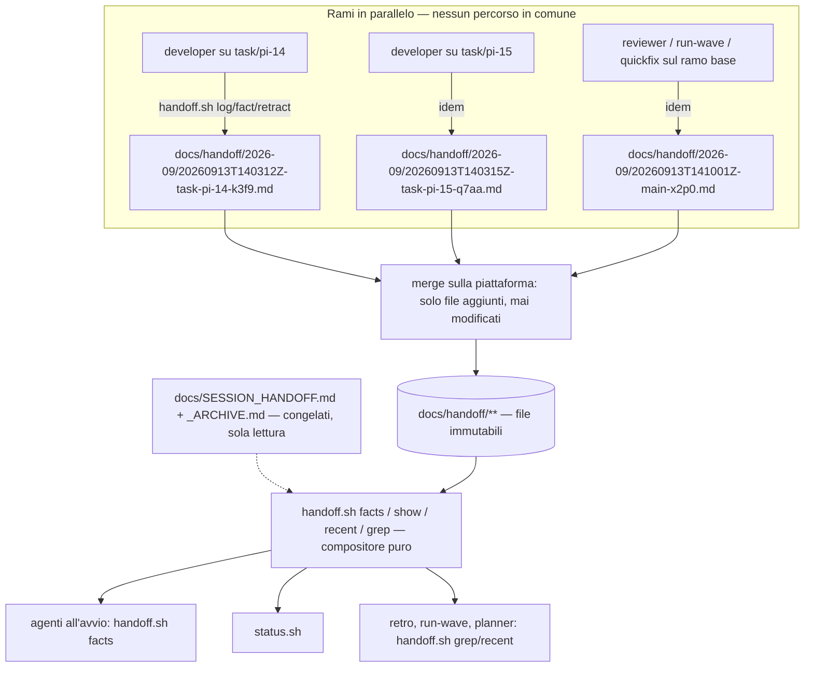

# Memoria della pipeline senza contesa — Documento di architettura tecnica

| Campo | Valore |
|---|---|
| Sistema | Sottosistema memoria di pocket-it (`docs/SESSION_HANDOFF.md`, `bin/handoff.sh`, `bin/status.sh`, punti di lettura e scrittura degli agenti) |
| Versione | 2.0 |
| Data | 2026-09-13 |
| Scope | MVP tooling — `scope: simple`, `pipeline: false`, teamSize 1 |
| Fonte | `tasks/PI-12-handoff-without-contention.md`, review di PR #39 (7 punti) |

> **Perimetro.** Non è il TAD di progetto di pocket-it: copre **solo** il sottosistema memoria. Le sezioni non pertinenti restano numerate con una riga `N/A`.
>
> **Deroga dichiarata.** `scope: simple` prevede ≤ 150 righe. Questo documento ne usa di più perché il deliverable è soprattutto §12 (task con criteri che il planner copia, non inventa), §2.4 (alternative misurate) e §9.2 (compatibilità). Le sezioni non pertinenti occupano una riga.

---

## 1. Sintesi

Oggi la memoria della pipeline è un file solo, e tutti scrivono nello stesso punto. I merge li decide la piattaforma di hosting, che non applica i driver di merge del repository. La contesa va **tolta**, non mitigata. **Ogni scrittura crea un file nuovo, con un nome unico, che nessuno modificherà più**. La memoria leggibile viene **composta al momento della lettura** da `handoff.sh`. Nessun percorso sotto `docs/handoff/` riceve scritture da due rami, e nemmeno due scritture dallo stesso ramo, quindi il conflitto non può esistere, per costruzione. Il vecchio file **si congela**, senza migrazione: nessuna riga si sposta, quindi nessuna riga si può perdere spostandola. Chi legge vede una cosa sola, con un comando invece di un `awk`. **Fatto quando:** quattro rami che scrivono memoria (due task e due `chore` sul ramo base, uno dei quali continua dopo uno squash) si fondono senza conflitti in un test. Inoltre, sulla memoria reale di questo repo, il multinsieme delle righe visibili contiene quello di oggi.

---

## 2. Architettura

### 2.1 Stile e motivo

**Frammenti immutabili, uno per scrittura, composti in lettura.** È il pattern «news fragments» di towncrier e changesets, con due differenze. (1) Il frammento non è per ramo né per voce di changelog: è **per invocazione**. Una volta creato il file non viene più toccato, quindi non esiste un «proprietario» da stabilire. (2) La composizione avviene **a ogni lettura** e il risultato non viene mai salvato in un file versionato. Una compilazione periodica sarebbe di nuovo un punto di serializzazione e di modifica a mano, cioè il punto in cui l'incidente d'origine ha perso due righe.

Scartati: driver di merge, frammento per ramo, serializzazione dei merge, composizione al merge e migrazione del vecchio file (§2.4).

### 2.2 Diagramma



### 2.3 Componenti

| Componente | Tipo | Responsabilità | Tecnologia |
|---|---|---|---|
| `bin/handoff.sh` | CLI | unico punto di scrittura (crea file, non ne modifica) e di composizione (non scrive mai) | bash 3.2 + python3 |
| `docs/handoff/{AAAA-MM}/{stamp}-{slug}-{rand}.md` | Dato | una voce (log, fatto o ritiro), creata una volta, mai modificata | markdown |
| `docs/SESSION_HANDOFF.md` | Sorgente congelata | memoria di prima del cambio; `handoff.sh` non la scrive più, il compositore la legge per sempre | markdown |
| `docs/SESSION_HANDOFF_ARCHIVE.md` | Sorgente congelata | log ruotato da PI-8; stesso trattamento | markdown |
| `docs/handoff/archive/{AAAA-MM}-{stamp}-{rand}.md` | Dato | mesi chiusi compattati (PI-18), sezioni per frammento d'origine | markdown |
| `bin/status.sh` | Lettore | fatti e ultime righe tramite il compositore | bash |
| `bin/doctor.sh` | Guardia | righe tolte da una sorgente congelata dopo il congelamento | bash |

### 2.4 Decisioni

**ADR-1: la contesa si elimina, non si gestisce**
- **Decisione:** nessun file viene scritto due volte. La vista unica è calcolata in lettura.
- **Perché:** il conflitto non dipende da chi fonde, ma dal fatto che due rami toccano lo stesso percorso. Se ogni scrittura crea un percorso nuovo, il merge si riduce a un'unione di file aggiunti, e questo vale ovunque venga eseguito.
- **Scartati:**
  - (a) **Driver di merge `union`.** La piattaforma non consulta i `.gitattributes`: è una limitazione documentata, e progetti grandi hanno rimosso l'attributo per questo. Ma anche dove viene applicato, cioè nei merge locali, `union` non risolve. Concatena i blocchi in conflitto senza conoscere le sezioni. **Misurato** in review con l'`handoff.sh` attuale e due rami (`fact` + `log` con rotazione attiva): merge pulito, però un fatto finisce sotto `## Log`, il log arriva a 43/40 righe, righe ruotate compaiono duplicate nell'archivio e ancora in testa, e l'ordine per data si rompe. In pratica trasforma un conflitto visibile in una corruzione silenziosa, la stessa classe di perdita dell'incidente. Sulla piattaforma la PR resta `CONFLICTING`. Resta scartata qualunque variante che dipenda da un'impostazione locale del repo.
  - (b) **Serializzare i merge:** rinuncia al parallelismo.
  - (c) **Comporre il file al merge:** il file condiviso resta nell'albero e confligge prima della composizione.
  - (d) **Tenere tutto com'è:** costo misurato di un'ondata da sette task: sei PR bloccate, tre giri di sola riconciliazione, due righe di memoria perse.

**ADR-2: composizione in lettura, mai un file generato e committato, e nessuna lettura scrive**
- **Decisione:** nessuna vista generata viene versionata. `facts`, `show`, `recent` e `grep` sono letture pure: dopo ognuna `git status --porcelain` resta invariato. Sparisce anche il `sed -i` di normalizzazione che oggi `handoff.sh` esegue a ogni comando.
- **Perché:** un file generato e committato è di nuovo un file che tutti toccano. Una lettura che scrive sporca il checkout principale del reviewer e fa committare a ogni worktree una modifica propria.
- **Scartati:** vista generata e committata; vista gitignorata (invisibile ai worktree); normalizzazione in lettura.

**ADR-3: il vecchio file si congela, non si migra**
- **Decisione:** da PI-16 `handoff.sh` non scrive più `docs/SESSION_HANDOFF.md` né `docs/SESSION_HANDOFF_ARCHIVE.md`. Il compositore li legge come sorgenti congelate, per sempre. Legge tutte le righe `- ` delle sezioni Fatti e Log, comprese quelle arrivate dopo con il merge di un ramo aperto prima del cambio. Nessuna riga viene travasata, nessun file `00-migrato-*`, nessuna lapide. Un repo nuovo non crea mai il vecchio file: il compositore tollera la sua assenza.
- **Perché:** «ogni riga che non si sposta è una riga che non si può perdere» (ADR-4). La migrazione aveva due buchi, **misurati** in review:
  - una PR aperta prima del cambio e fusa dopo la lapide produce un conflitto modify/modify, e chi lo risolve tenendo la lapide perde la riga;
  - una migrazione che parte in lettura sporca il checkout.

  Con il congelamento, dopo il cambio `main` non tocca più quel file, quindi un ramo pre-cambio si fonde senza conflitti.
- **Scartati:** migrazione pigra in `handoff.sh` (i due buchi sopra); migrazione manuale per repo (dimenticata in almeno un progetto); lapide o avviso scritto dentro il file congelato (è una modifica, quindi riapre il modify/modify con i rami pre-cambio).

**ADR-4: la rotazione sparisce, i tetti si contano sul visibile, un fatto si toglie con un ritiro**
- **Decisione:**
  - `LOGCAP` (40) diventa il numero di righe *mostrate*.
  - Il tetto dei fatti (100) resta un tetto di scrittura, contato sui **fatti visibili**.
  - Un fatto si toglie con `retract`, che crea un frammento di ritiro. Nessun file esistente viene toccato, né dal retro né a mano.
- **Perché:** la rotazione di PI-8 serviva a tenere leggibile un file unico, e con la composizione la leggibilità diventa un parametro della vista. Senza un modo di togliere un fatto, il tetto raggiunto sarebbe permanente. Oggi esistono tre modi (la «Facts hygiene» del retro, il «remove one line by hand» del messaggio al tetto, la correzione prevista da `implementing-common.md` §3). Modificare il frammento di un altro ramo riporterebbe la contesa: il ritiro li sostituisce tutti e tre senza toccare nessun file.
- **Scartati:** rotazione dei frammenti (sposta righe); cancellazione del file del fatto (un fatto che sta in una sorgente congelata non ha un file proprio, e cancellarlo in un ramo mentre un altro lo legge crea delete/modify sulle sorgenti congelate); nessun limite di visualizzazione (lettura più cara a ogni avvio).

**ADR-5: un frammento per invocazione, non per ramo**
- **Decisione:** `docs/handoff/{AAAA-MM}/{AAAAMMGGTHHMMSSZ}-{slug}-{rand4}.md`.
  - Lo slug è il nome del ramo sanificato (`[^a-z0-9]` → `-`, al massimo 40 caratteri), oppure `detached-{sha7}`. Serve solo a chi apre la cartella, non a garantire l'unicità.
  - `rand4` sono 4 caratteri `[a-z0-9]` da `/dev/urandom`.
  - Il file si crea in modo esclusivo (`set -o noclobber`). Se il nome esiste già se ne genera un altro: il file non viene mai sovrascritto né esteso.
- **Criterio:** nessun percorso sotto `docs/handoff/` riceve scritture da due invocazioni. È quindi impossibile che lo scrivano due rami diversi.
- **Perché:** il reviewer, `run-wave` e `quickfix` scrivono dal checkout principale, sul ramo base, e le loro righe arrivano con PR `chore` diverse. Con un file per ramo, due di queste PR aggiungono in fondo allo stesso `_base.md`, e la review lo ha **misurato**: `CONFLICT (content)`. Anche il file per ramo dei task cede. Le PR vengono fuse con `--squash`, e un ramo che scrive ancora dopo lo squash va in `CONFLICT (add/add)` sul proprio frammento. **Misurato** qui: un file per ramo più squash più una riga successiva dà conflitto. Con file per invocazione, due rami task, due rami `chore` e un ramo che continua dopo lo squash danno **0 conflitti** e 9 righe visibili su 9.
- **Scartati:**
  - file per ramo più `_base.md` (conflitto misurato);
  - file per ramo più file per invocazione solo sul ramo base (add/add misurato dopo lo squash, e due regole invece di una);
  - uuid senza timestamp (nessun ordine gratuito);
  - numero di PR (non noto alla prima scrittura).

---

## 3. Tecnologie

| Livello | Tecnologia | Versione | Perché | Scartati |
|---|---|---|---|---|
| Script | bash | 3.2 (macOS di serie) | vincolo dell'ambiente: niente array associativi, niente `mapfile` | bash 5 (non garantito) |
| Composizione | python3 | ≥ 3.9 | già usato da `handoff.sh`; ordinamento stabile, `hashlib.sha1`, multinsiemi con `collections.Counter` | `awk`/`sort` (fragile con ordinamento stabile e hash) |
| Storage | file markdown in git | — | la memoria viaggia nella PR ed è visibile ai worktree | sqlite/JSON (diff illeggibili), servizio esterno (rompe i worktree) |
| Test | shell test in-repo | `bin/handoff.test.sh`, `bin/doctor.test.sh` | già nel `testCommand` | framework esterni |

### 3.1 Configurazione database
N/A — nessun database.

---

## 4. Struttura dei dati

### 4.1 Disposizione

```
docs/
├── SESSION_HANDOFF.md            # congelato: letto per sempre, mai più scritto da handoff.sh
├── SESSION_HANDOFF_ARCHIVE.md    # congelato: idem
└── handoff/
    ├── 2026-09/
    │   ├── 20260913T140312Z-task-pi-14-k3f9.md    # una voce, immutabile
    │   └── 20260913T141001Z-main-x2p0.md          # scrittura dal ramo base: stessa regola
    └── archive/2026-08-20261002T090000Z-a1b2.md   # mese chiuso compattato (PI-18)
```

### 4.2 Formato del frammento

Un frammento contiene esattamente una sezione e una voce:

```markdown
## Log
- 2026-09-13 14:03 PI-14 PR #41 draft — compositore — 11 test
```

Le sezioni ammesse sono `## Log`, `## Fatti` e `## Ritirati`. Una voce `## Ritirati` ha la forma `- ~ {sha1 del testo del fatto, primi 12 caratteri esadecimali}`, dove il testo è quello senza il prefisso `- `. Le righe di log portano `AAAA-MM-GG HH:MM` in UTC. Un archivio compattato (PI-18) contiene una sezione `### {nome del frammento d'origine}` per ogni frammento piegato, con le sue righe identiche all'originale.

### 4.3 Ordinamento e deduplicazione

| Aspetto | Regola |
|---|---|
| Ordine del log composto | chiave 1: il giorno `AAAA-MM-GG` della riga, decrescente. Chiave 2: prima i frammenti (per timestamp del nome, decrescente, poi nome), poi le righe congelate (nel loro ordine nel file: log dall'alto, archivio dal basso). L'ordinamento è stabile, quindi totale e deterministico. Una riga di un ramo pre-cambio fusa dopo è stata scritta prima dell'installazione, quindi cade al suo giorno, non in fondo alla vista |
| Ordine dei fatti | prima i fatti congelati nell'ordine del file, poi i fatti dei frammenti per timestamp crescente, come l'aggiunta in fondo di oggi. Senza frammenti, l'output è byte-identico all'`awk` di oggi |
| Deduplicazione del log | **mai**: né dentro una sorgente né fra sorgenti. Due righe uguali in due posti sono due eventi. L'uguaglianza fra insiemi di righe si verifica come **multinsieme** |
| Deduplicazione dei fatti | un fatto è un'affermazione, non un evento: la vista mostra una sola volta un testo identico (la prima occorrenza nell'ordine sopra). È la stessa identità, il testo, su cui lavorano `fact` («già presente») e `retract` (hash del testo). La verifica dei fatti si fa quindi come insieme. Oggi i fatti duplicati in `SESSION_HANDOFF.md` sono 0 (misurato) |
| Copie dichiarate | l'unica deduplicazione per identità: una sezione `### {nome}` di un archivio e il frammento `{nome}`, o due archivi con la stessa sezione, sono la **stessa** sorgente e si contano una volta. L'identità è il nome del frammento, mai il contenuto |
| Ritiri | un ritiro con hash `h` nasconde ogni fatto con `sha1(testo)[:12] == h` che sta in una sorgente **più vecchia** del ritiro (le sorgenti congelate sono più vecchie di tutto). Un fatto riscritto dopo il ritiro torna visibile: correggere un fatto significa `retract` del vecchio più `fact` del nuovo |

### 4.4 Ritenzione, tetti, archivio

- **Nessuna riga viene cancellata né spostata**, a parte la compattazione di PI-18, che piega copie dichiarate e verifica il multinsieme.
- **Tetto del log (40):** limite di visualizzazione di `show` e `status.sh`. Il resto si vede con `recent N` o `--all`.
- **Tetto dei fatti (100):** contato sui fatti visibili, cioè dopo i ritiri e la deduplicazione dei fatti. Al tetto `fact` esce con 3, e il messaggio rimanda a `retract` e al retro, non più a una modifica a mano. Due scritture parallele possono superare il tetto di poco (`facts: 101/100 (oltre il tetto)`). È accettato: una consistenza forte richiederebbe un punto condiviso.
- **Potatura:** il retro pota **solo** con `retract`. Sposta un fatto in `best-practices/` e poi lo ritira, oppure ritira un fatto che racconta storia. Nessuna modifica a mano di un file sotto `docs/`.
- **PI-8:** la rotazione viene rimossa. L'archivio resta congelato e visibile con `recent N` o `--all`.
- **Compattazione (PI-18):** piega solo frammenti **già presenti sul ramo base** di mesi chiusi in un nuovo file `archive/{AAAA-MM}-{stamp}-{rand}.md` e cancella gli originali. Gli originali sono immutabili, quindi un altro ramo non può averli modificati. Due compattazioni concorrenti cancellano gli stessi file (delete/delete si fonde pulito) e producono due archivi con le stesse sezioni, che per identità si contano una volta.

---

## 5. Contratto della CLI

### 5.1 Convenzioni
Il punto d'ingresso non cambia: `bash ~/.claude/agents/pocket-it/bin/handoff.sh {comando}`. Codici d'uscita: `0` ok, `2` uso errato, `3` fatti al tetto. Ogni scrittura conferma il file creato (contratto di PI-9). Le letture non scrivono niente (ADR-2).

### 5.2 Comandi

| Comando | Cosa fa | Chi lo usa | Task |
|---|---|---|---|
| `facts` | stampa solo le righe dei fatti visibili, senza intestazioni | lettura di avvio di ogni agente | PI-14 |
| `show` | fatti visibili + ultime 40 righe di log | umani | PI-14 |
| `recent N` \| `recent --all` | ultime N righe di log, oppure tutte, sorgenti congelate incluse | retro, planner | PI-14 |
| `grep REGEX` | righe di log composte che corrispondono | retro e run-wave (`BUDGET\|STALL`) | PI-14 |
| `log "testo"` | crea un frammento `## Log` con `- {AAAA-MM-GG HH:MM} testo` | developer, reviewer, qa, run-wave, quickfix, deps — **chiamata invariata** | PI-16 |
| `fact "testo"` | crea un frammento `## Fatti` se il testo non è già visibile; esce con 3 al tetto | idem | PI-16 |
| `retract "testo esatto"` | crea un frammento `## Ritirati` con l'hash; esce con 2 se il testo non è fra i fatti visibili | retro, chi corregge un fatto | PI-16 |
| `where` | stampa la cartella in cui scriverebbe (`docs/handoff/{AAAA-MM}/`) ed esce con 0. È anche il **segnale** che PI-16 è installato (§9.2): lo script vecchio risponde `usage` con uscita 2 | orchestratore, regola ponte, test | PI-16 |

### 5.3 Costo della lettura di avvio

La lettura sta nel percorso di avvio di **ogni** agente. Oggi è un `awk` che stampa al massimo 100 fatti. Domani sarà `handoff.sh facts`, che stampa le stesse righe senza intestazioni né nomi di file. **Criterio misurabile:** su una memoria senza frammenti, l'output è byte-identico all'`awk` odierno. Il numero di file sul disco non entra nell'output, quindi non entra nel costo in token.

---

## 6. Sicurezza

- Nessun segreto nella memoria: la regola resta «fatti ed eventi, mai stato né credenziali».
- L'isolamento dei progetti non cambia: i frammenti di questo repo pubblico non contengono nulla dei progetti.
- `handoff.sh` scrive solo sotto `docs/handoff/` e solo con creazione esclusiva. Lo slug è sanificato (niente `..` né `/`), quindi un nome di ramo ostile non può far scrivere fuori dalla cartella.

## 7. Frontend
N/A — sottosistema CLI.

## 8. Architettura dello script

### 8.1 Struttura
Tre responsabilità separate:
- **risoluzione:** repo, ramo, slug, mese, nome unico;
- **creazione:** un file esclusivo, controllo «già visibile», tetto;
- **composizione:** raccolta delle sorgenti, identità delle copie dichiarate, ritiri, ordinamento, finestra.

La composizione è l'unico punto che conosce il formato. La usano `facts`, `show`, `recent`, `grep`, `fact` (per il controllo del tetto) e `status.sh`.

### 8.2 Pattern
Solo creazione di file e letture pure, senza stato condiviso: non servono lock.

### 8.3 Lavori in background
N/A — la compattazione è un comando esplicito del retro.

### 8.4 Cache
N/A — una cache sarebbe uno stato condiviso.

---

## 9. Distribuzione e compatibilità

### 9.1 Come arriva ai progetti
Le sessioni leggono script e prompt dalla copia installata. `bin/install-live.sh` (PI-30) la aggiorna da `main` pubblicato dopo ogni merge; fino allo switch del README la copia letta è il checkout di sviluppo. Script e prompt arrivano quindi **insieme** alla stessa installazione, in tutti i repo e worktree aperti, anche a metà sessione. L'ordine dei task (§12) è scelto in modo che nessuna installazione intermedia lasci un lettore cieco: **prima i lettori, poi gli scrittori**. PI-14 e PI-15 fanno leggere le sorgenti vecchie tramite il compositore mentre le scritture vanno ancora nel vecchio file. Solo PI-16 sposta le scritture, e a quel punto ogni lettore passa già dal compositore.

### 9.2 Sessioni, worktree e progetti in transizione

| Situazione | Comportamento |
|---|---|
| Ramo aperto prima di PI-16, con righe scritte dal vecchio script nel vecchio file, fuso dopo | nessun conflitto con `main`, perché `main` non tocca più quel file. Le righe entrano nella sorgente congelata e il compositore le mostra (AC in PI-17). Due rami pre-cambio possono ancora confliggere **fra loro**, come oggi: è un residuo limitato ai rami aperti prima dell'installazione |
| Agente lanciato prima dell'installazione che scrive dopo | lo script si legge al momento dell'invocazione, quindi scrive un frammento |
| Agente con un prompt vecchio che fa `awk` sul file | non esiste: prompt e script arrivano con la stessa installazione, e PI-15 entra prima di PI-16 |
| Lettori fuori da questo repo: le istruzioni globali della sessione principale e i prompt di lancio dei progetti che citano «i Fatti di `docs/SESSION_HANDOFF.md`» | li aggiorna l'orchestratore, non un task di questo repo, quando `handoff.sh where` esce con 0. Fino ad allora il testo resta corretto, perché le scritture vanno ancora nel vecchio file |
| **Regola ponte** | un progetto che scrive il diario in `docs/reports/` finché i frammenti non sono in uso smette il giorno in cui `bash ~/.claude/agents/pocket-it/bin/handoff.sh where` esce con 0, il segnale verificabile che PI-14, PI-15 e PI-16 sono installati. Le righe già scritte nei report non vengono importate: restano nei report, che il retro legge. Da quel momento il diario torna a `handoff.sh log`. Nota: con lo script vecchio `where` crea o normalizza `docs/SESSION_HANDOFF.md` prima di rispondere 2 (righe 16–29 dello script attuale). È innocuo in un progetto che ha già il file, ma il segnale va letto nella radice del progetto e non altrove |
| Ritorno indietro | ripristinare lo script precedente. I frammenti restano in git, e `handoff.sh show > file` ricostruisce una vista unica se serve |

### 9.3 CI/CD
`pipeline: false`: nessuna CI ospitata. Le porte sono locali: `bash bin/handoff.test.sh` e il `testCommand` prima di ogni PR. Il gate `APP_STATUS` è disponibile ma non costruito; si accende con `gh variable set APP_STATUS --body prod`, per decisione umana. Deploy: `N/A — deployment not managed by CI yet`.

### 9.4 Variabili d'ambiente
N/A — `CAP=100` e `LOGCAP=40` restano variabili in testa allo script (PI-8).

### 9.5 Osservabilità
`handoff.sh where` e `recent --all`. `doctor.sh` segnala righe tolte da una sorgente congelata (PI-17).

### 9.6 Recupero
La memoria è fatta di file immutabili in git, e le sorgenti congelate sono protette da `doctor.sh`.

---

## 10. Crescita
- ~1 file per scrittura. Misurato su questo repo: circa 140 voci in due settimane, quindi ~300 file al mese prima della compattazione. PI-18 li riduce a un file per mese chiuso.
- Il costo in token della lettura non cresce: dipende dai tetti di visualizzazione, non dal numero di file.
- La composizione cresce linearmente nelle righe totali, ma è tempo di script (≪ 1 s per decine di migliaia di righe), non token.

---

## 11. Test

### 11.1 Piramide

| Livello | Strumento | Cosa copre | Giustificazione |
|---|---|---|---|
| Unit | `bin/handoff.test.sh` (repo temporanei) | nome unico e creazione esclusiva, formato, ordinamento, ritiri, tetti, codici d'uscita, letture pure | richiesto |
| Integrazione | stesso file, repo git temporaneo con più rami | la prova di non-contesa (§11.2) e la prova del congelamento (PI-17) | il criterio centrale è un comportamento di `git merge`, non di una funzione |
| E2E | — | N/A | nessuna interfaccia utente |

### 11.2 Ambiente di test
Un repo git temporaneo per caso. La prova di non-contesa si esegue **con `.gitattributes` vuoto e `GIT_ATTR_NOSYSTEM=1`**: un test che passa grazie a `union` ripeterebbe l'errore. Lo scenario usa **quattro rami** da una base comune:
- `task/a` e `task/b` scrivono `log` + `fact` + `retract`;
- `chore/1` e `chore/2` scrivono ciascuno una riga sul ramo base, emulando reviewer e run-wave;
- `task/a` viene fuso con `--squash` e poi scrive ancora.

Tutti i merge devono dare 0 conflitti, e il multinsieme di `recent --all` deve essere uguale all'unione delle righe scritte.

### 11.3 Porte di qualità
Tutte locali. Per ogni criterio si esegue una **mutazione** e la si riporta nella PR: rosso con la logica invertita, verde dopo. Ogni PR che tocca sorgenti o composizione stampa nel corpo i conteggi prima e dopo, sulla copia della memoria reale di questo repo.

---

## 12. Suddivisione in task

Cinque task: due M, tre S. L'ordine segue §9.1, prima i lettori e poi gli scrittori, così nessuna installazione intermedia perde o nasconde una riga. Numerazione verificata con `ls tasks/`: PI-14…PI-18 sono liberi (occupati PI-1…PI-13 e PI-19…PI-33).

| # | Task | Stima | Budget | Risk | Dipende da | Wave |
|---|---|---|---|---|---|---|
| PI-14 | Compositore in sola lettura | M | 200 | med | — | 1 |
| PI-15 | I lettori passano al compositore | S | 120 | low | PI-14 | 2 |
| PI-16 | Le scritture diventano frammenti immutabili; congelamento; `retract` | M | 200 | **high** | PI-15 | 3 |
| PI-17 | Prova del congelamento e guardia in `doctor.sh` | S | 120 | low | PI-16 | 4 |
| PI-18 | Compattazione dei mesi chiusi | S | 120 | low | PI-17 | 5 |

**Percorso critico:** PI-14 → PI-15 → PI-16 → PI-17, ~4–6 giorni-uomo (PI-18 escluso). **Perché PI-16 è `high`:** è la modifica che ogni agente di ogni progetto usa alla prossima scrittura, e contiene la prova di non-contesa. Va su `opus`, e la PR non si approva senza mutazioni e conteggi nel corpo.

### PI-14 — Compositore in sola lettura
**File:** `bin/handoff.sh`, `bin/handoff.test.sh`. **Additivo:** `log` e `fact` restano quelli di oggi.
- **AC1:** Given la copia di `docs/SESSION_HANDOFF.md` di questo repo, senza frammenti, When `handoff.sh facts`, Then l'output è byte-identico a `awk '/^## Fatti/{f=1;next} /^## /{f=0} f && /^- /' docs/SESSION_HANDOFF.md`.
- **AC2:** Given la stessa copia più `SESSION_HANDOFF_ARCHIVE.md`, When `handoff.sh recent --all`, Then il multinsieme delle righe è uguale al multinsieme delle righe `- ` di Log più quelle dell'archivio (conteggio stampato nella PR).
- **AC3:** Given frammenti di prova (`## Log`, `## Fatti`, `## Ritirati`, due righe di log identiche in due frammenti, una sezione d'archivio con lo stesso nome di un frammento), When `recent --all` e `facts`, Then le due righe identiche compaiono due volte, la copia dichiarata una volta sola, il fatto ritirato non compare, e lo stesso fatto riscritto dopo il ritiro compare.
- **AC4:** Given un repo pulito con o senza il vecchio file, When si eseguono `facts`, `show`, `recent 5`, `grep X`, Then `git status --porcelain` è identico prima e dopo e nessun file viene creato.
- **AC5:** Given una riga congelata datata 2026-09-10 e frammenti del 2026-09-11 e 2026-09-12, When `recent --all`, Then l'ordine è 12, 11, 10, e a parità di giorno i frammenti vengono prima delle righe congelate.

### PI-15 — I lettori passano al compositore
**File:** `bin/status.sh:37-40`, `.claude/agents/shared/implementing-common.md:39`, `.claude/agents/developer.md:32`, `.claude/agents/reviewer.md:19`, `.claude/agents/retro.md:23-24`, `.claude/agents/implementation-planner.md:56`, `.claude/agents/shared/lessons.md:3`, `.claude/skills/run-wave/SKILL.md:50`. Nessuna chiamata di scrittura cambia.
- **AC1:** Given il repo dopo il task, When `git grep -nE "(^|[^a-z])(awk|grep|cat|head|tail) .*SESSION_HANDOFF|-f docs/SESSION_HANDOFF|facts of .?docs/SESSION_HANDOFF|SESSION_HANDOFF\.md.? facts" -- ':!docs' ':!tech-analysis' ':!tasks' ':!bin/handoff.sh' ':!bin/handoff.test.sh'`, Then l'output è vuoto. Oggi la stessa espressione restituisce 11 righe, cioè gli 11 punti elencati sopra (misurato): è la mutazione dell'AC.
- **AC2:** Given la memoria di questo repo, When `bash bin/status.sh`, Then le righe `handoff facts:` e `handoff log (last 4):` sono identiche a quelle stampate su `main` prima del task.
- **AC3:** Given un repo senza memoria (né vecchio file né frammenti), When `bash bin/status.sh`, Then stampa una riga «handoff: nessuna memoria» ed esce con 0, senza creare file.

### PI-16 — Le scritture diventano frammenti immutabili; congelamento; `retract`
**File:** `bin/handoff.sh` (con l'intestazione 4–10), `bin/handoff.test.sh` (i test di rotazione PI-8 diventano test di non-rotazione), e tutti i testi che descrivono o prescrivono la scrittura:
- `.claude/agents/shared/implementing-common.md:104,118`
- `.claude/agents/developer.md:112`
- `.claude/agents/retro.md:3,34,48,58`
- `.claude/skills/quickfix/SKILL.md:79`
- `.claude/skills/run-wave/SKILL.md:48`
- `CLAUDE.md:78,79,160,161,164`
- `README.md:46,74`

Restano invariate le chiamate di sola scrittura in `reviewer.md:95-96`, `qa-engineer.md:94`, `deps/SKILL.md:17`, `implementing-common.md:101,132,133`.
- **AC1 (non-contesa):** Given lo scenario a quattro rami di §11.2 con `GIT_ATTR_NOSYSTEM=1`, When si fondono tutti, `task/a` con squash e poi di nuovo dopo una nuova scrittura, Then 0 conflitti e il multinsieme di `recent --all` è uguale alle righe scritte. La mutazione con un file per ramo produce il conflitto.
- **AC2 (nessuna scrittura due volte):** Given 50 invocazioni `log` nello stesso secondo sullo stesso ramo, When si contano i file, Then ci sono 50 file distinti, ciascuno con una voce, e nessun file esistente ha cambiato mtime o contenuto.
- **AC3 (congelamento):** Given un repo con il vecchio file, When `log`, `fact` e `retract`, Then `git diff -- docs/SESSION_HANDOFF.md docs/SESSION_HANDOFF_ARCHIVE.md` è vuoto. Given un repo senza vecchio file, Then il vecchio file non viene creato.
- **AC4 (ritiro senza toccare altri):** Given un fatto presente in un frammento creato su un altro ramo e in una sorgente congelata, When `retract "testo"`, Then `facts` non lo mostra più e quei file sono invariati byte per byte (hash prima e dopo).
- **AC5 (tetto):** Given 100 fatti visibili, When `fact "nuovo"`, Then esce con 3 e il messaggio contiene `retract`. When si esegue `retract` di un fatto e poi `fact "nuovo"`, Then esce con 0 e i visibili sono 100.
- **AC6 (memoria reale):** Given la copia della memoria di questo repo, When una `log` e una `fact`, Then l'insieme di `facts` contiene l'insieme dell'`awk` di oggi più il nuovo fatto, e il multinsieme di `recent --all` contiene log più archivio di oggi più la nuova riga.
- **AC7 (segnale):** Given lo script installato, When `handoff.sh where`, Then stampa `docs/handoff/{AAAA-MM}/` ed esce con 0.
- **AC8 (testi):** Given il repo dopo il task, When `git grep -n "SESSION_HANDOFF" -- ':!docs' ':!tech-analysis' ':!tasks'`, Then ogni riga restituita descrive la sorgente congelata o sta in `bin/handoff.sh` o nel suo test. Nessuna riga dice «prepends», «kept to 40», «creates docs/SESSION_HANDOFF.md» o «remove one line by hand», e la Facts hygiene di `retro.md` pota con `retract`.
- **Note:** i lettori fuori dal repo (istruzioni globali della sessione principale, prompt di lancio con la regola ponte) li aggiorna l'orchestratore dopo l'installazione. Non sono un AC di questo task.

### PI-17 — Prova del congelamento e guardia in `doctor.sh`
**File:** `bin/doctor.sh`, `bin/doctor.test.sh`, `bin/handoff.test.sh`.
- **AC1:** Given un ramo creato prima del cambio che aggiunge righe (log con rotazione e fatto) al vecchio file con lo script vecchio, e `main` che dopo il cambio ha frammenti nuovi, When si fonde il ramo su `main`, Then 0 conflitti, e `facts` e `recent --all` mostrano le righe del ramo.
- **AC2:** Given il punto di congelamento, cioè il primo commit che aggiunge un file sotto `docs/handoff/` (`git log --diff-filter=A --reverse --format=%H -- docs/handoff | head -1`), e un `HEAD` in cui il multinsieme delle righe `- ` di `SESSION_HANDOFF.md` ∪ `SESSION_HANDOFF_ARCHIVE.md` non contiene più quello del punto di congelamento, When `doctor.sh`, Then esce con errore e nomina la riga mancante. Given uno spostamento dal log all'archivio, fatto dalla rotazione di un ramo pre-cambio, Then nessun errore.
- **AC3:** Given un commit che modifica un file esistente sotto `docs/handoff/` (stato `M` in `git log --diff-filter=M --format=%H -- docs/handoff`), When `doctor.sh`, Then errore con il percorso. Given solo aggiunte, cancellazioni fatte da `compact` e merge con squash, Then nessun errore.

### PI-18 — Compattazione dei mesi chiusi
**File:** `bin/handoff.sh`, `bin/handoff.test.sh`, `.claude/agents/retro.md`.
- **AC1:** Given frammenti di un mese chiuso, alcuni presenti sul ramo base e altri solo su un ramo aperto, When `handoff.sh compact --before AAAA-MM` sul ramo del retro, Then vengono piegati solo i frammenti del ramo base, e i file del ramo aperto non sono toccati (dopo il merge restano visibili).
- **AC2:** Given la memoria prima e dopo `compact`, When si confrontano `recent --all` e `facts`, Then il multinsieme del log e l'insieme dei fatti sono uguali.
- **AC3:** Given due `compact` concorrenti su due rami con insiemi sovrapposti, When si fondono, Then 0 conflitti e nessuna riga duplicata nella vista, grazie all'identità per nome di §4.3.
- **AC4:** Given la vista dopo `compact`, When `doctor.sh`, Then nessun errore (AC3 di PI-17).

---

## 13. Rischi e domande

| ID | Rischio | Prob. | Impatto | Mitigazione |
|---|---|---|---|---|
| R-01 | Righe perse nel cambio | B | A | Nessuna riga si sposta (ADR-3). AC di multinsieme sulla memoria reale in PI-14 e PI-16 |
| R-02 | Un file scritto da due rami riporta il conflitto | B | A | Un file per invocazione con creazione esclusiva (ADR-5). Scenario a quattro rami con squash in PI-16 AC1, con mutazione |
| R-03 | Una sorgente congelata viene riscritta (retro vecchio, risoluzione a mano) | M | A | Guardia di `doctor.sh` (PI-17 AC2). Il retro pota solo con `retract` |
| R-04 | La lettura di avvio costa di più | B | A | Byte-identità con l'`awk` (PI-14 AC1) |
| R-05 | Il tetto dei fatti viene superato da scritture parallele | M | B | Dichiarato nella vista; il retro ritira |
| R-06 | Troppi file e diff rumorosi | A | B | Cartelle per mese, PI-18; il costo in token resta invariato |
| R-07 | Collisione di nomi fra macchine diverse | B | M | Secondo UTC + slug del ramo + 4 caratteri casuali: due rami diversi dovrebbero coincidere su tutti e tre. In locale la creazione esclusiva rigenera il nome |
| R-08 | Due rami pre-cambio confliggono ancora fra loro sul vecchio file | M | B | Residuo limitato ai rami aperti prima dell'installazione. Il merge si risolve come oggi; PI-17 AC2 intercetta una riga tolta |

**Domande bloccanti:** nessuna.

**Decisioni aperte (con raccomandazione):**
- **DA-1 — Avviso nel file congelato.** Un umano che apre `docs/SESSION_HANDOFF.md` non sa che è fermo. *Raccomandazione:* nessun avviso dentro il file, perché modificarlo riapre il modify/modify con i rami pre-cambio (ADR-3). Lo dicono `README.md` e `CLAUDE.md` (PI-16 AC8). Si può rivalutare quando `doctor.sh` non vede più rami pre-cambio aperti.
- **DA-2 — Quando fare PI-18.** *Raccomandazione:* dopo il primo mese chiuso con frammenti, non prima. Senza compattazione non si perde nulla: si guadagna solo ordine nella cartella.

**Non bloccanti:**
- [ ] Se pocket-it adotterà un `.gitattributes` per altri motivi, verificare che non reintroduca promesse che la piattaforma non mantiene.
- [ ] La lezione `provisional` del 2026-09-11 sul file narrativo condiviso va aggiornata dal retro: la «PR di chiusura che fonde i frammenti» è superata dalla composizione in lettura.
- [ ] Le righe del reviewer restano sul ramo base, un file per invocazione. Le PR `chore(handoff)` restano, ma non confliggono più.

---

## Fonti

- [kubernetes/kubernetes#70576 — rimozione del driver `union` perché la piattaforma non lo supporta](https://github.com/kubernetes/kubernetes/pull/70576)
- [Discussione community #9288 — `merge=union` nei merge lato piattaforma](https://github.com/orgs/community/discussions/9288)
- [PyInstaller — voci di changelog come frammenti indipendenti (towncrier)](https://pyinstaller.org/en/stable/development/changelog-entries.html)
- [protokolo — frammenti aggregati solo in lettura/release](https://pypi.org/project/protokolo/2.1.2)

---

## Revisioni

| Versione | Data | Nota |
|---|---|---|
| 1.0 | 2026-09-12 | Prima stesura |
| 1.1 | 2026-09-12 | Auto-revisione: versioni, alternative, criterio di costo misurabile, deroga |
| 1.2 | 2026-09-12 | Sequenza PI-14…PI-18, fonti |
| 2.0 | 2026-09-13 | Review PR #39, 7 punti. (1) Un frammento per invocazione invece che per ramo e `_base.md`: conflitto `_base.md` misurato in review, add/add dopo squash misurato qui, 0 conflitti con quattro rami. (2) `retract` e tetto sui fatti visibili. (3) Log mai deduplicato, verifica a multinsieme, identità per nome delle copie dichiarate. (4) Vecchio file congelato invece che migrato, letture pure. (5) Misura di `union` in ADR-1(a). (6) Elenco completo di lettori e testi da `git grep` in PI-15/PI-16, più i lettori esterni. (7) AC Given/When/Then per PI-14…PI-18, ordine «prima i lettori, poi gli scrittori», regola ponte con `where` |
