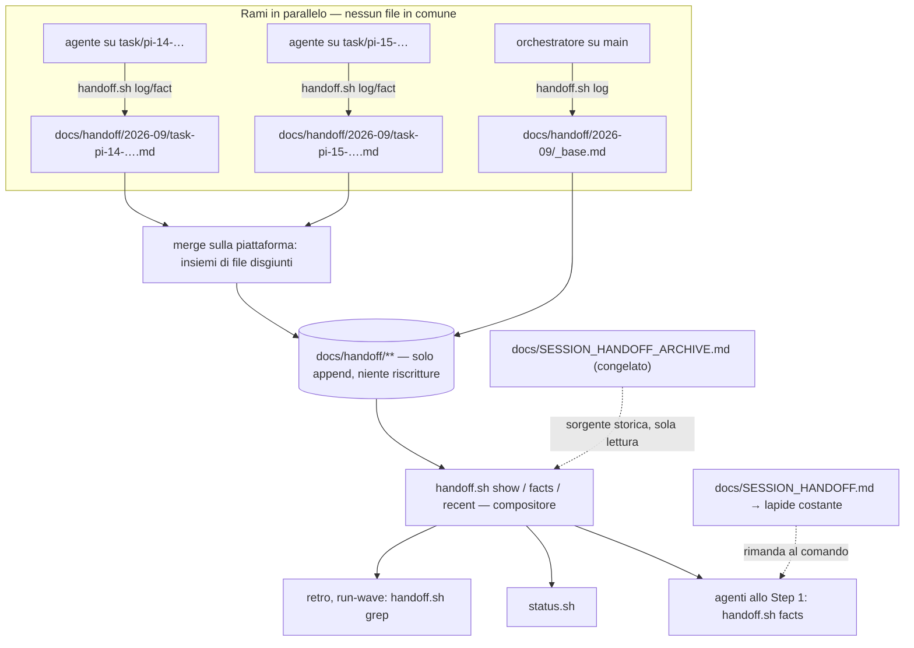

# Memoria della pipeline senza contesa — Documento di architettura tecnica

| Campo | Valore |
|---|---|
| Sistema | Sottosistema memoria di pocket-it (`docs/SESSION_HANDOFF.md`, `bin/handoff.sh`, `bin/status.sh`, punti di lettura degli agenti) |
| Versione | 1.2 |
| Data | 2026-09-12 |
| Scope | MVP tooling — `scope: simple`, `pipeline: false`, teamSize 1 |
| Fonte | `tasks/PI-12-handoff-without-contention.md` |

> **Perimetro.** Questo non è il TAD di progetto di pocket-it e non va letto come tale: copre **solo** il sottosistema memoria. Tutto il resto del repo (board, wave, hook, agenti) è contesto. Le sezioni non pertinenti restano numerate con una riga `N/A` per non rompere la mappa delle sezioni.
>
> **Deroga dichiarata.** `scope: simple` prevede ≤ 150 righe; questo documento ne usa il doppio perché il deliverable richiesto è soprattutto §12 (suddivisione in task) e §2.4 (alternative scartate con il motivo), e perché §9.2 (compatibilità) è il punto in cui questo cambio può fare danno. Nessuna sezione di riempimento: le sezioni non pertinenti sono una riga.

---

## 1. Sintesi

La memoria della pipeline è un file solo su cui tutti scrivono nello stesso punto, e i merge della pipeline li decide la piattaforma di hosting, che non applica i driver di merge del repository. La contesa va **tolta**, non mitigata: ogni scrittore scrive un frammento suo, che nessun altro tocca; la memoria leggibile viene **composta al momento della lettura** da `handoff.sh`. Due rami che scrivono file diversi non hanno nulla da fondere, quindi il conflitto smette di esistere per costruzione e non per disciplina. Chi legge non paga niente in più: continua a vedere una cosa sola, le stesse righe di oggi, con un comando invece di un `awk` su un file. Fatto quando: due rami paralleli che scrivono memoria si fondono puliti in un test, e nessuna riga della memoria esistente è andata persa nella migrazione.

---

## 2. Architettura

### 2.1 Stile e motivo

**Frammenti append-only per ramo, composti in lettura** (pattern «news fragments»: towncrier, changesets, protokolo). Si discosta dal pattern standard su un punto: lì i frammenti vengono compilati in un file al momento della release, qui vengono composti **a ogni lettura** e non vengono mai compilati in un file versionato. Motivo: una compilazione periodica è essa stessa un punto di serializzazione e una modifica a mano — cioè esattamente il punto in cui, nell'incidente che ha originato questo lavoro, sono sparite due righe di log.

Scartati: driver di merge (§2.4 ADR-1), serializzazione dei merge, composizione a merge-time.

### 2.2 Diagramma



### 2.3 Componenti

| Componente | Tipo | Responsabilità | Tecnologia |
|---|---|---|---|
| `bin/handoff.sh` | CLI | unico punto di scrittura e di composizione della memoria | bash 3.2 + python3 (già così) |
| `docs/handoff/{AAAA-MM}/{slug}.md` | Dato | frammento append-only, un solo ramo scrittore | markdown |
| `docs/SESSION_HANDOFF.md` | Lapide | file costante che rimanda al comando; non più scritto | markdown |
| `docs/SESSION_HANDOFF_ARCHIVE.md` | Archivio | storia pre-migrazione, sola lettura, mai più scritto | markdown |
| `bin/status.sh` | Lettore | mostra fatti e ultime righe chiamando il compositore | bash |
| `bin/doctor.sh` | Guardia | rileva stati a metà migrazione | bash |

### 2.4 Decisioni

**ADR-1: la contesa si elimina, non si gestisce**
- **Decisione:** ogni scrittore ha il proprio file; la vista unica è calcolata in lettura.
- **Perché:** il conflitto non dipende dalla bravura di chi fonde ma dal fatto che due rami toccano le stesse righe. Insiemi di file disgiunti rendono il conflitto impossibile a prescindere da chi esegue il merge e da dove.
- **Scartati:** (a) *driver di merge `union`* — già provato e fallito: l'attributo vive nel repository, i merge della pipeline li valuta la piattaforma di hosting, che non consulta i `.gitattributes` dell'utente; è una limitazione nota e documentata, al punto che progetti grandi hanno rimosso l'attributo proprio per questo. Qualunque variante che dipenda da un'impostazione locale del repo è la stessa strada. (b) *serializzare i merge* — rinuncia al parallelismo, cioè alla ragione per cui la pipeline esiste. (c) *far comporre il file da uno script al merge* — il file condiviso resta nell'albero e continua a confliggere **prima** della composizione; sposta il problema di mezz'ora. (d) *tenere tutto com'è* — costo misurato: un'ondata da sette task, sei PR bloccate, tre giri di sola riconciliazione, zero righe di prodotto e due righe di memoria perse.

**ADR-2: composizione in lettura, mai un file generato e committato**
- **Decisione:** nessuna vista generata viene versionata. `handoff.sh show` la stampa.
- **Perché:** un file generato e committato è di nuovo un file che tutti toccano — la contesa rientrerebbe dalla finestra.
- **Scartati:** vista generata committata; vista generata e gitignorata (invisibile agli agenti in worktree, che vedono solo ciò che è committato).

**ADR-3: la migrazione è pigra e vive dentro `handoff.sh`**
- **Decisione:** `handoff.sh` migra da solo, in modo idempotente, alla prima invocazione in un repo che ha ancora il file vecchio, verificando i conteggi prima di sostituire.
- **Perché:** `handoff.sh` è installato una volta (`~/.claude/agents/pocket-it/bin/`) e usato da N progetti privati. Una migrazione manuale per progetto verrebbe dimenticata in almeno uno, e lì la memoria si perderebbe. Con la migrazione pigra il progetto migra da solo alla prima scrittura utile, dentro la PR di chi ha scritto.
- **Scartati:** script di migrazione una tantum da lanciare a mano per repo; nessuna migrazione (perdita della memoria esistente, vietata dal vincolo).

**ADR-4: i tetti diventano limiti di visualizzazione, la rotazione sparisce**
- **Decisione:** `LOGCAP` (40) diventa quante righe si *mostrano*; nessuna riga viene più spostata di file. Il tetto dei fatti (100) resta un tetto di **scrittura** contato sulla vista composta.
- **Perché:** la rotazione introdotta da PI-8 esiste per tenere leggibile un file unico. Con la composizione la leggibilità è un parametro della vista, e ogni riga che non si sposta è una riga che non si può perdere spostandola.
- **Scartati:** rotazione dei frammenti (reintrodurrebbe scritture su file di altri); nessun limite di visualizzazione (lettura più cara a ogni avvio, vietata dal vincolo 1).

**ADR-5: il nome del frammento deriva dal ramo corrente**
- **Decisione:** `docs/handoff/{AAAA-MM}/{slug-del-ramo}.md`, dove lo slug è il nome del ramo con `/` e caratteri non alfanumerici sostituiti da `-`, troncato a 60 caratteri. `HEAD` staccato → `detached-{sha7}`. Sul ramo base → `_base.md`.
- **Perché:** il nome del ramo è già unico per task, è disponibile senza stato condiviso e senza coordinamento, ed è leggibile da un umano che apre la cartella. Uno scrittore che scrive due volte sullo stesso ramo scrive sul proprio file: nessuna contesa neppure con sé stesso.
- **Scartati:** nome casuale/uuid (illeggibile, un file per riga, diff rumorosi); nome per agente (due agenti diversi sullo stesso ramo — developer poi reviewer — sono sequenziali, non concorrenti: dividere sarebbe inutile); numero di PR (non noto al momento della prima scrittura).

---

## 3. Tecnologie

| Livello | Tecnologia | Versione | Perché | Scartati |
|---|---|---|---|---|
| Script | bash | 3.2 (macOS di serie) | vincolo dell'ambiente: niente array associativi, niente `mapfile` | bash 5 (non garantito) |
| Composizione/parsing | python3 | ≥ 3.9 | già usato da `handoff.sh` e `status.sh`; ordinamento stabile e dedup senza dipendenze | `awk`/`sort` puro (ordinamento stabile e dedup a righe più fragili) |
| Storage | file markdown in git | — | la memoria deve viaggiare nella PR ed essere visibile ai worktree | sqlite/JSON (illeggibili a mano, diff inutilizzabili), servizio esterno (rompe l'isolamento dei worktree) |
| Test | shell test in-repo | `bin/handoff.test.sh` | convenzione del repo, `testCommand` già li esegue | framework esterni |

### 3.1 Configurazione database
N/A — nessun database. Lo stato è file in git.

---

## 4. Struttura dei dati

### 4.1 Disposizione

```
docs/
├── SESSION_HANDOFF.md              # lapide, contenuto costante, mai più scritto
├── SESSION_HANDOFF_ARCHIVE.md      # storia pre-migrazione, sola lettura
└── handoff/
    ├── 2026-09/
    │   ├── _base.md                # scritto solo dal ramo base (orchestratore)
    │   ├── 00-migrato-{slug}.md    # contenuto travasato dalla migrazione
    │   └── task-pi-14-….md         # un ramo, un file
    └── archive/2026-08.md          # mesi chiusi compattati (PI-18), sola aggiunta
```

### 4.2 Formato del frammento

```markdown
# handoff · task/pi-14-motore-frammenti
<!-- Frammento: solo questo ramo scrive qui. Vista composta: bash bin/handoff.sh show -->

## Log
- 2026-09-12 14:03 PI-14 PR #41 draft — motore a frammenti — 11 test

## Fatti
- handoff.sh: il frammento prende il nome dal ramo, non dall'agente
```

Regole del formato: **solo aggiunta in fondo alla propria sezione** (mai prepend, mai riscrittura); una voce è una riga che inizia con `- `; le righe di log portano `AAAA-MM-GG HH:MM` in UTC.

### 4.3 Ordinamento e deduplicazione

| Aspetto | Regola |
|---|---|
| Ordine del log composto | chiave `timestamp` decrescente; parità risolta da (percorso del frammento, posizione nel file) — ordine totale e deterministico |
| Righe migrate senza orario | trattate come `00:00`; stanno tutte in un unico frammento e l'ordinamento è **stabile**, quindi il loro ordine reciproco originale è preservato esattamente |
| Ordine dei fatti | percorso del frammento, poi posizione: stabile, nessun riordino visibile fra una lettura e l'altra |
| Deduplicazione | righe identiche collassate in una, su tutti i frammenti. È anche ciò che rende innocue due migrazioni concorrenti |

Il minuto nel timestamp è la ragione per cui l'ordine è totale senza stato condiviso: è il costo di 6 caratteri per riga e sostituisce qualunque contatore, che sarebbe stato condiviso e quindi conteso.

### 4.4 Ritenzione, tetti, archivio

- **Nessuna riga viene mai cancellata né spostata.** L'unica operazione di scrittura è l'aggiunta in fondo al proprio frammento.
- **Tetto del log (40):** diventa un limite di *visualizzazione* (`show`, `status.sh`). Le righe oltre il quarantesimo restano dove sono e si vedono con `recent N` o `--all`.
- **Tetto dei fatti (100):** resta un tetto di scrittura, contato sulla vista composta; al tetto `fact` rifiuta con uscita 3, come oggi. Con due scritture in parallelo il tetto può essere superato di poco (99 + 99 → 101): è accettato, la vista lo dichiara (`facts: 101/100 (oltre il tetto)`) e il retro pota. Preferire una consistenza forte qui significherebbe reintrodurre un punto condiviso, cioè il problema.
- **Archiviazione di PI-8:** la rotazione viene rimossa; `docs/SESSION_HANDOFF_ARCHIVE.md` resta **congelato** e viene letto dal compositore come sorgente più vecchia solo con `--all`/`recent N` oltre la finestra. Il lavoro di PI-8 non viene buttato: il suo risultato diventa storia, e la classe di bug che affrontava (righe perse spostandole) sparisce insieme allo spostamento.
- **Compattazione (PI-18):** i mesi chiusi si piegano in `docs/handoff/archive/{AAAA-MM}.md`. Nessuna contesa: un mese chiuso non ha più scrittori vivi, e l'operazione la fa il retro sul proprio ramo.

---

## 5. Contratto della CLI

### 5.1 Convenzioni
Punto d'ingresso invariato: `bash ~/.claude/agents/pocket-it/bin/handoff.sh {comando}`. Codici d'uscita invariati: `0` ok, `2` uso errato, `3` fatti al tetto. Ogni conferma continua a nominare il file scritto (contratto di PI-9), che ora è il frammento.

### 5.2 Comandi

| Comando | Cosa fa | Chi lo usa |
|---|---|---|
| `log "testo"` | aggiunge `- {data} {ora} testo` al frammento del ramo corrente | developer, reviewer, qa, run-wave, quickfix — **nessuna modifica ai prompt** |
| `fact "testo"` | aggiunge un fatto se non già presente nella vista composta; rifiuta al tetto (uscita 3) | idem |
| `facts` | stampa **solo** le righe dei fatti, niente intestazioni | lettura di avvio di ogni agente |
| `show` | vista composta: fatti + ultime 40 righe di log | umani, `handoff.sh show` |
| `recent N` \| `--all` | ultime N righe di log, archivio incluso | retro, run-wave |
| `grep REGEX` | righe di log che corrispondono, sulla vista composta | retro (`BUDGET\|STALL`), run-wave |
| `where` | stampa il percorso del frammento del ramo corrente | test, doctor, diagnosi |
| `migrate [--check]` | migrazione esplicita e idempotente (la stessa che parte da sola) | migrazione, doctor |

### 5.3 Costo della lettura di avvio

Vincolo governante: la lettura sta nel percorso di avvio di **ogni** agente. Oggi è un `awk` su un file che stampa ≤ 100 righe di fatti. Domani è `handoff.sh facts`, che stampa **le stesse righe** senza intestazioni né nomi di file. Criterio di accettazione misurabile: l'output di `handoff.sh facts` è byte-identico all'`awk` odierno a parità di contenuto, quindi il costo in token non sale — e la memoria resta *una cosa sola da capire*: un comando, una vista. Il numero di frammenti sul disco non entra nell'output e quindi non entra nel costo.

---

## 6. Sicurezza

- Nessun segreto nella memoria: la regola resta «fatti e eventi, mai stato né credenziali».
- Isolamento dei progetti invariato: il contenuto dei frammenti è soggetto alla stessa regola del file unico (in questo repo pubblico non entra nulla dei progetti).
- Superficie di scrittura: `handoff.sh` scrive solo sotto `docs/handoff/` e solo in aggiunta; il percorso del frammento è derivato e sanificato (niente `..`, niente `/`), quindi un nome di ramo ostile non può far scrivere fuori dalla cartella.

---

## 7. Frontend
N/A — sottosistema CLI.

## 8. Architettura dello script

### 8.1 Struttura
`handoff.sh` si divide in tre responsabilità nette, oggi intrecciate: **risoluzione** (dove scrivo: repo, ramo, slug, mese), **scrittura** (aggiunta al proprio frammento, dedup dei fatti, tetto), **composizione** (raccolta, ordinamento, dedup, finestra). La composizione è l'unico punto che conosce il formato: `show`, `facts`, `recent`, `grep` e `status.sh` la usano tutti.

### 8.2 Pattern
Scrittura solo in aggiunta, lettura pura, nessuno stato condiviso fra invocazioni: due processi che aggiungono a due file diversi non hanno bisogno di lock, e due processi sullo stesso file (stesso ramo) sono sequenziali per costruzione.

### 8.3 Lavori in background
N/A — la compattazione (PI-18) è un comando esplicito del retro.

### 8.4 Cache
N/A — comporre qualche migliaio di righe sta sotto i 100 ms; una cache sarebbe uno stato condiviso, cioè il problema.

---

## 9. Distribuzione e compatibilità

### 9.1 Come arriva ai progetti
`handoff.sh` viene invocato dal percorso installato (`~/.claude/agents/pocket-it/bin/`), non da una copia nel progetto. Appena il cambio entra in `main` di pocket-it, **tutti** i repo e tutti i worktree aperti usano la nuova versione, anche a metà sessione. Da qui discendono due obblighi di progetto: la migrazione deve essere pigra (ADR-3) e il vecchio file deve restare leggibile senza ingannare (la lapide).

### 9.2 Sessioni e worktree già aperti

| Situazione | Comportamento |
|---|---|
| Agente lanciato prima del cambio che scrive dopo | scrive sul frammento del proprio ramo; la migrazione pigra scatta sul suo ramo e viaggia nella sua PR |
| Due PR aperte che migrano entrambe | la lapide è **a contenuto costante** (nessuna data, nessun ramo, nessun conteggio): due lati che fanno la stessa identica modifica si fondono puliti; i due frammenti `00-migrato-*` hanno righe identiche e il compositore le deduplica → nessuna perdita, nessun duplicato, nessun conflitto |
| Agente il cui prompt dice ancora di fare `awk` sul file vecchio | l'`awk` trova la sezione `## Fatti che non scadono` con **una riga sola**: «MEMORIA SPOSTATA: esegui `bash bin/handoff.sh facts` — questo file non è più aggiornato». Un lettore vecchio riceve un'istruzione, non un silenzio: è per questo che la lapide conserva l'intestazione invece di sparire |
| Ritorno indietro | `handoff.sh show > docs/SESSION_HANDOFF.md` ricostruisce il file di prima dai frammenti: il cambio è reversibile in un comando |

### 9.3 CI/CD
`pipeline: false`: nessuna CI ospitata. Le porte si applicano in locale — `bash bin/handoff.test.sh` e il `testCommand` del progetto prima di ogni PR. Il gate `APP_STATUS` resta non costruito; si accende con `gh variable set APP_STATUS --body prod`, decisione umana, non di questo documento. Deploy: `N/A — deployment not managed by CI yet`.

### 9.4 Variabili d'ambiente
N/A — nessuna. I due parametri (`CAP=100`, `LOGCAP=40`) restano variabili in testa allo script, sorgente unica del numero come stabilito da PI-8.

### 9.5 Osservabilità
`handoff.sh where` e `migrate --check` rendono ispezionabile lo stato; `doctor.sh` segnala gli stati a metà migrazione (PI-17).

### 9.6 Recupero
La memoria è in git: recupero = `git log`/`git show` sui frammenti. La migrazione verifica i conteggi prima di toccare qualsiasi cosa e, se non tornano, non tocca niente ed esce diversa da zero.

---

## 10. Crescita
- I frammenti crescono di ~1 file per task, qualche riga l'uno: un'epica da 30 task lascia 30 file piccoli.
- Il costo di **lettura in token non cresce**: dipende dai tetti di visualizzazione (40 righe di log, 100 fatti), non dal numero di file.
- Il costo di composizione cresce linearmente nelle righe totali, ma è tempo di script, non token. La compattazione mensile (PI-18) tiene ordinata la cartella senza cancellare una riga.

---

## 11. Test

### 11.1 Piramide

| Livello | Strumento | Cosa copre | Giustificazione |
|---|---|---|---|
| Unit | `bin/handoff.test.sh` (shell, repo temporanei) | risoluzione dello slug, aggiunta, dedup, ordinamento, tetti, codici d'uscita, idempotenza e verifica della migrazione | richiesto |
| Integrazione | stesso file, repo git temporaneo con due rami | **la prova di non-contesa**: due rami scrivono memoria, il merge passa pulito e la vista composta contiene entrambe le righe | qui l'integrazione se la merita: il criterio centrale (AC2 del task) è un comportamento di `git merge`, non di una funzione |
| E2E | — | N/A | nessuna interfaccia utente |

### 11.2 Ambiente di test
Repo git temporaneo per caso, come già fa `bin/handoff.test.sh`. **La prova di non-contesa va eseguita con `.gitattributes` vuoto e `GIT_ATTR_NOSYSTEM=1`**, cioè senza alcun driver di merge: è così che si emula la piattaforma di hosting, ed è l'unica versione del test che dimostra qualcosa. Un test che passa grazie al driver `union` ripeterebbe l'errore che stiamo correggendo.

### 11.3 Porte di qualità
Tutte locali (`pipeline: false`): `bash bin/handoff.test.sh` verde, più il `testCommand` completo del repo prima di ogni PR. Per ogni criterio, **mutazione eseguita**: la riga della PR mostra il rosso ottenuto invertendo la logica e il verde dopo. Il caso della migrazione ha una porta in più: conteggio fatti e log prima e dopo, identici, stampati nel corpo della PR.

---

## 12. Suddivisione in task

Cinque task, due M e tre S. Ogni passo lascia la memoria completa e leggibile: non esiste uno stato intermedio in cui qualcosa è scritto e non si legge. La numerazione parte da **PI-14** perché PI-13 è già occupato (fail-open delle guardie sul push): in questo repo due task con lo stesso id si mascherano a vicenda in `next-wave.sh` ed è già successo — è un fatto scritto nella memoria. Chi crea i file di task verifichi `ls tasks/` prima di assegnare un numero.

| # | Task | Stima | Budget | Risk | Dipende da | Wave | File |
|---|---|---|---|---|---|---|---|
| PI-14 | **Motore a frammenti in `handoff.sh`** — scrittura sul frammento del ramo, composizione (`show`, `facts`, `recent`, `grep`, `where`), ordinamento totale, dedup, tetti come da §4.4. **Additivo**: il compositore legge ancora anche il vecchio file, che resta com'è. Include la prova di non-contesa di §11.2 | M | 200 | med | — | 1 | `bin/handoff.sh`, `bin/handoff.test.sh` |
| PI-15 | **I punti di lettura passano al compositore** — `status.sh` (fatti + ultime righe), `shared/implementing-common.md` §3, `retro.md` (righe 23–24), `run-wave/SKILL.md`, tabelle di `CLAUDE.md` e `README.md`. Nessun punto di *scrittura* cambia: le chiamate `handoff.sh log|fact` restano identiche. Verifica anche la conseguenza di §13: la riga di review viaggia nella PR rivista, quindi le PR `chore(handoff)` di sola riga non servono più | S | 120 | low | PI-14 | 2 | `bin/status.sh`, `.claude/agents/shared/implementing-common.md`, `.claude/agents/retro.md`, `.claude/skills/run-wave/SKILL.md`, `CLAUDE.md`, `README.md` |
| PI-16 | **Migrazione pigra e lapide** — travaso di fatti e log nel frammento `00-migrato-{slug}`, verifica dei conteggi prima di toccare qualsiasi cosa (discrepanza → non tocca niente, esce ≠ 0), lapide a contenuto costante, idempotenza, due migrazioni concorrenti che si fondono pulite, archivio congelato | M | 200 | **high** | PI-14 | 2 | `bin/handoff.sh`, `bin/handoff.test.sh`, `docs/SESSION_HANDOFF.md` |
| PI-17 | **Prova end-to-end e guardia** — scenario completo a due rami su un repo con memoria pre-esistente (migrazione + scritture + merge + vista composta), più il controllo in `doctor.sh` per lo stato a metà migrazione (file vecchio vivo *e* frammenti presenti) | S | 120 | low | PI-15, PI-16 | 3 | `bin/doctor.sh`, `bin/doctor.test.sh`, `bin/handoff.test.sh` |
| PI-18 | **Compattazione mensile** — `handoff.sh compact [--before AAAA-MM]` che piega i mesi chiusi in `docs/handoff/archive/{AAAA-MM}.md` in sola aggiunta, con verifica dei conteggi; una riga nel retro che lo esegue a fine epica. Opzionale: si fa quando la cartella infastidisce | S | 120 | low | PI-17 | 4 | `bin/handoff.sh`, `bin/handoff.test.sh`, `.claude/agents/retro.md` |

**Ordine e motivo.** PI-14 prima perché è additivo e reversibile: finché il vecchio file è ancora una sorgente, niente può andare perso. PI-15 e PI-16 sono paralleli (insiemi di file disgiunti a parte `handoff.sh`, che è solo di PI-16) e l'ordine fra loro è indifferente: se PI-15 entra prima, i lettori usano il compositore che già include il file vecchio; se entra prima PI-16, i lettori vecchi trovano la lapide che li rimanda al comando. PI-17 chiude quando entrambi sono dentro. PI-18 è igiene e può aspettare un'epica.

**Percorso critico:** PI-14 → PI-16 → PI-17. Totale ~4–6 giorni-uomo, PI-18 escluso.

**Perché PI-16 è `Risk: high`:** è l'unico task che tocca memoria esistente. Va lanciato su `opus` e la sua PR non si approva senza i conteggi prima/dopo stampati nel corpo.

---

## 13. Rischi e domande

| ID | Rischio | Prob. | Impatto | Mitigazione |
|---|---|---|---|---|
| R-01 | La migrazione perde righe (il vincolo esplicito del task) | B | A | Verifica dei conteggi *prima* di sostituire, abort senza toccare nulla in caso di discrepanza, conteggi nel corpo della PR, e in ogni caso il contenuto originale resta in git |
| R-02 | Migrazioni concorrenti su più PR aperte generano duplicati o conflitti | M | M | Lapide a contenuto costante (modifiche identiche si fondono) + dedup delle righe identiche in composizione. Coperto da un test dedicato in PI-16 |
| R-03 | Agenti con prompt vecchio leggono una memoria vuota senza accorgersene | M | A | La lapide conserva l'intestazione e contiene una riga che *dice* dove è andata la memoria: il lettore vecchio riceve un'istruzione, mai un silenzio |
| R-04 | La lettura di avvio diventa più cara e si paga a ogni lancio | B | A | `handoff.sh facts` emette le stesse righe di oggi senza intestazioni; criterio di accettazione misurabile in §5.3, verificato in PI-14 |
| R-05 | Il tetto dei fatti viene superato da scritture parallele | A | B | Accettato e dichiarato dalla vista (`oltre il tetto`); il retro pota. Una consistenza forte richiederebbe un punto condiviso, cioè il problema |
| R-06 | Proliferazione di file e diff rumorosi nella cartella `docs/handoff/` | M | B | Sottocartelle per mese + compattazione PI-18; nessun impatto sul costo di lettura, che dipende dai tetti e non dai file |

**Domande bloccanti:** nessuna. I punti ambigui sono stati decisi e dichiarati: (1) il documento è un TAD di sottosistema e non il TAD di progetto; (2) la lapide resta al posto del file invece di essere cancellata; (3) il tetto dei fatti accetta uno sforamento transitorio; (4) la compattazione è opzionale e ultima.

**Non bloccanti:**
- [ ] Se pocket-it adotterà un `.gitattributes` per altri motivi, verificare che non reintroduca promesse che la piattaforma non mantiene.
- [ ] La lezione `provisional` del 2026-09-11 sul file narrativo condiviso va aggiornata dal retro: la parte «una PR di chiusura fonde i frammenti» è superata — la composizione in lettura toglie anche quella PR, che era un punto di serializzazione e di modifica a mano.
- [ ] Con i frammenti, le PR `chore(handoff)` aperte solo per far atterrare una riga di review non servono più: la riga del reviewer viaggia nella PR che sta rivedendo. Da confermare in PI-15.

---

## Fonti

La diagnosi del task (l'attributo di merge non viene consultato dalla piattaforma) è confermata a monte, e il rimedio scelto è il pattern corrente per la stessa classe di problema:

- [kubernetes/kubernetes#70576 — rimozione del driver `union` perché la piattaforma non lo supporta](https://github.com/kubernetes/kubernetes/pull/70576)
- [Discussione community #9288 — richiesta di supportare `merge=union` nei merge lato piattaforma](https://github.com/orgs/community/discussions/9288)
- [PyInstaller — voci di changelog come frammenti indipendenti (towncrier)](https://pyinstaller.org/en/stable/development/changelog-entries.html)
- [protokolo — frammenti separati aggregati solo al momento della lettura/release](https://pypi.org/project/protokolo/2.1.2)

---

## Revisioni

| Versione | Data | Nota |
|---|---|---|
| 1.0 | 2026-09-12 | Prima stesura |
| 1.1 | 2026-09-12 | Auto-revisione: versioni degli strumenti esplicitate, alternative aggiunte a ogni ADR, criterio di costo della lettura reso misurabile (§5.3), deroga sul numero di righe dichiarata |
| 1.2 | 2026-09-12 | Sequenza rinumerata PI-14…PI-18 (PI-13 già occupato), riferimenti incrociati allineati, fonti citate nel documento |
